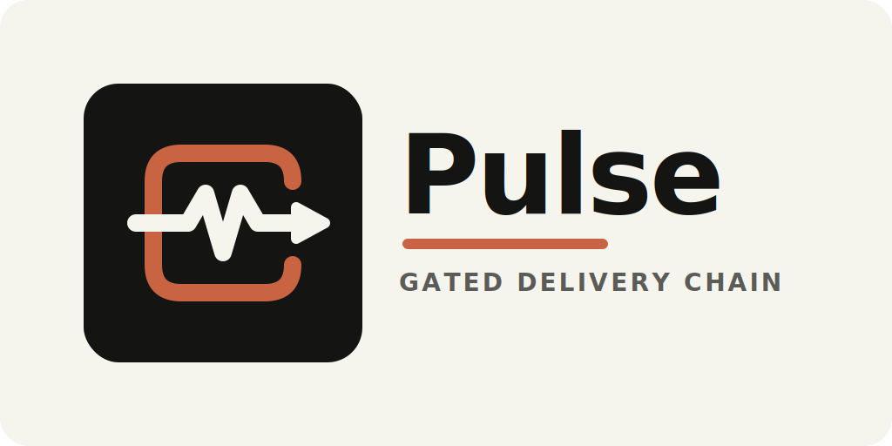
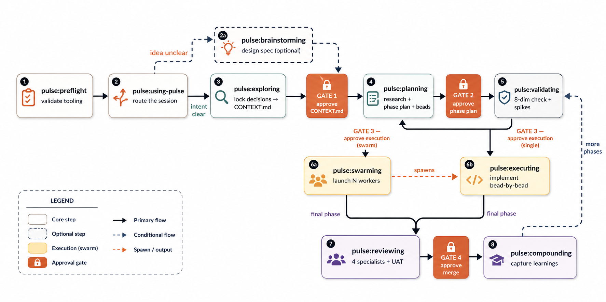

<div align="center">



# Pulse

<p><strong>A gated delivery chain system for Claude Code and Codex</strong></p>

<p>
  <a href=".codex-plugin/plugin.json">
    
  </a>
  <a href="docs/legal/terms.md">
    
  </a>
  <a href="skills">
    
  </a>
</p>

<p><em>Stop agents from hallucinating requirements, skipping verification, and producing unauditable work.</em></p>

</div>

---

## What is Pulse?

Pulse wraps AI agents in a **gated delivery chain**. Every decision is locked before planning starts. Every plan is approved before code is written. Every bead of work is verified before it's closed. Every feature is reviewed before it merges.

Without this structure, agents skip steps. With it, they can't.

Pulse ships as a **skills package** — each skill is a `SKILL.md` file loaded into context at invocation. The workflow contract lives in those skill files, while repo-local Node helpers handle onboarding, state sync, dependency checks, and local coordination. There is no separate orchestration service to deploy. Pulse is a docs-first skill plugin that uses the tools you already have.

## What Pulse Is / Is Not

Pulse is:

- a validate-first, docs-first workflow for Claude Code and Codex
- a skill ecosystem that routes work through explicit gates and artifacts
- a repo-local skill + control-plane package: `SKILL.md` defines the workflow contract, and local Node helpers keep that contract operable
- a way to turn vague requests into reviewed, auditable delivery slices
- a foundation-first feature workflow that defines architecture, ownership, and boundaries before phase slicing begins

Pulse is not:

- a default autonomous runtime that should silently execute work end-to-end
- a replacement for human approval at Gates 1-4
- a pure-markdown, zero-runtime system
- a separate always-on orchestration service or full Mission Control-style control tower
- a system that frames new features as MVPs, prototype subsets, or temporary architecture to be cleaned up later

## One-Line Glossary

- `CONTEXT.md` — the locked decisions the rest of the workflow is not allowed to drift from.
- `phase-plan.md` — the whole-feature breakdown into meaningful delivery slices.
- phase contract — the proof obligations, constraints, and exit conditions for the current phase.
- story map — the ordering logic that explains why the beads happen in that sequence.
- bead — one worker-sized unit of work with exact files, checks, and decision links.
- handoff — the pause/resume contract that says where work stopped and what happens next.
- `pulse_status` — the read-only scout surface for current workflow state and key artifact pointers.
- project docs — repo-level `CONTEXT.md`, `CONTEXT-MAP.md`, and `docs/adr/` that define durable project truth outside feature history.
- `.pulse/project-docs.json` — Pulse's routing map for discovered or approved project docs in the target repo.

## Project Docs vs Feature History

Pulse treats downstream repo docs as a separate input plane from `history/<feature>/...` artifacts.

Supported repo patterns:

- `single-context` — one canonical root `CONTEXT.md`
- `multi-context` — one root `CONTEXT-MAP.md` plus per-context `CONTEXT.md` files
- optional ADR directories such as `docs/adr/`

When those docs already exist, Pulse reuses them. When they do not, `pulse:bootstrap-project-context` and downstream skills default to a lazy scaffold proposal and ask before creating files.

---

## What A Pulse Run Looks Like

Ask for a feature like:

> "Add inbound email support for the agent inbox."

Pulse moves that request through a repeatable chain:

1. `pulse:exploring` locks the missing decisions into `CONTEXT.md`.
2. `pulse:planning` turns those decisions into a phase plan, a current-phase contract, a story map, and beads.
3. `pulse:validating` checks that the current phase is sound before any implementation starts.
4. `pulse:swarming` coordinates the current phase, and `pulse:executing` implements beads with reservations and live graph coordination.
5. `pulse:reviewing` verifies the work and records P1/P2/P3 findings.
6. `pulse:compounding` captures durable learnings for future work.

The point is not ceremony for its own sake. The point is to make expensive misunderstandings and avoidable rework much less likely.

### Brainstorming Visual Support

`pulse:brainstorming` stays text-first. For most sessions, visual questions should use inline previews via `AskUserQuestion`.

For complex UI brainstorming only — layout comparison, styling direction, design-system composition, visual hierarchy, or multi-screen flow shape — the skill can reference local support assets directly (`references/spec-reviewer-prompt.md`, `references/visual-support-guidance.md`, and `evals/`) and optionally use the local visual runtime under `skills/brainstorming/scripts/`.

That runtime is not required for normal Pulse use:
- if Node is available and the local URL is reachable, the skill can render browser-served mockups and capture selections
- if the runtime is unavailable, Pulse falls back to previews and plain text without blocking the brainstorming workflow

## When To Use Pulse

Use Pulse when:

- the request is ambiguous or under-specified
- the work spans multiple files, systems, or agents
- the cost of getting the plan wrong is meaningful
- you want a reviewed and auditable path from request to shipped work
- the request is a new feature and you need architecture, ownership, and interfaces locked before implementation phases begin

Do not reach for the full chain when:

- the task is a one-line fix with no ambiguity
- the work is obviously local and low-risk
- you do not need beads, coordination, or formal review gates
- the work is a true non-feature correction rather than a new capability

Pulse phases feature delivery, but it does not frame features as MVPs. A first phase may be narrow, but new feature work still starts from the whole-feature architecture: enduring foundations, clear module ownership, stable interfaces, and boundaries that let modules evolve independently.

## Working Modes

Pulse keeps one core workflow but presents it in three user-facing modes:

- `small_change` — lightweight planning and validating for bounded low-risk fixes, local refactors, and non-feature adjustments
- `standard_feature` — the default full Pulse workflow for all new features and normal refactors
- `high_risk_feature` — the full workflow plus deeper planning scrutiny and stronger spike discipline for cross-cutting or architecture-sensitive features

The core contract does not change across modes:
- `CONTEXT.md` is still the source of truth
- `validating` still gates execution
- beads + `bv` + native runtime swarm adapters + local reservations still drive coordination

`Micro Mode` is not a fourth working mode. It is a user-approved shortcut exception for genuinely trivial, non-feature work, defined in `pulse:using-pulse`. Use it only for the narrow single-file cases that do not warrant even `small_change`.

---

## Lineage

Pulse is downstream of everal strong agentic-development systems and distills the parts that fit this repo owner's actual workflow:

- **[Khuym](https://github.com/hoangnb24/skills/tree/main)**, which provides most of the validate-first chain and Flywheel-style bead workflow
- **[Superpowers](https://github.com/obra/superpowers)**, which contributes the strongest behavioral discipline around brainstorming, verification, debugging, and skill design
- **[Flywheel](https://agent-flywheel.com/complete-guide)** contributes the operational backbone: beads, `bv`, swarm execution, and the habit of turning plans into live work graphs instead of loose TODO lists.
- **[Compound Engineering](https://github.com/EveryInc/compound-engineering-plugin)** contributes parallel review, severity-based findings, and the compound-learning loop that feeds future work.
- **[GSD](https://github.com/gsd-build/get-shit-done)** contributes the philosophy: discuss first, research second, plan third, and do not execute until the plan has been verified.

---

## The Delivery Chain

<p align="center">
  
</p>

### The 4 Human Gates

Every gate is a hard stop. Nothing proceeds without explicit approval.

| | Gate | Blocks what |
|---|---|---|
| 🔒 **Gate 1** | After exploring | Planning starts |
| 🔒 **Gate 2** | After phase plan | Beads are created |
| 🔒 **Gate 3** | After validating | Code is written |
| 🔒 **Gate 4** | After reviewing | Feature merges (P1 findings block this) |

---

## Skill Catalog

Skill and category inventory is generated from `skills/` and published as `skill-catalog.json` at the repo root.

- Output artifact: `skill-catalog.json`
- Policy: docs and marketplace metadata should describe capabilities, not hard-code skill counts.

---

## Key Concepts

### Beads
Work items with a strict schema. Planning creates them, executing closes them.

```
id, title, phase, story
files          ← exact list of files the worker may touch
verify         ← exact commands that must pass before close
verification_evidence ← path where evidence is written
testing_mode   ← standard | tdd-required
risk           ← LOW | MEDIUM | HIGH
dependencies   ← upstream bead IDs
learning_refs  ← relevant learning file paths
decision_refs  ← CONTEXT.md decision IDs (D1, D2...)
```

### Institutional Memory
Learnings flow upward through three propagation paths:

```
global-critical  →  .pulse/memory/critical-patterns.md        (all future planners read this)
bead-local       →  embedded in bead learning_refs            (workers read at implementation time)
planner-only     →  planning reference only
```

### Context Budget
Any long-running skill writes a handoff and stops at **65% context**. The next session resumes from `.pulse/handoffs/manifest.json` — no work is lost.

### Pipeline Modes

| Mode | When |
|------|------|
| **Full (`standard_feature`)** | Multi-phase feature, swarm available |
| **Single-worker** | Multi-phase feature, no swarm |
| **Small change (`small_change`)** | ≤3 files, no HIGH risk, no new API surface |
| **High risk (`high_risk_feature`)** | Cross-cutting or architecture-sensitive work |
| **Planning-only** | No execution tools available |

`Micro Mode` is a separate shortcut exception for genuinely trivial non-feature work. It is not a pipeline mode in this table because it is an explicit bypass path, not a standard delivery shape.

---

## 3-Plane Model

Pulse is getting clearer about three artifact planes:

1. **Control plane — `.pulse/`**
   - live workflow state
   - routing mirrors
   - `current-feature.json` as the active feature pointer
   - `runtime-snapshot.json` as the derived scout mirror
   - handoffs
   - operator surfaces for the active Pulse run
2. **Memory plane — `.pulse/memory/`**
   - the shared root for reusable cross-feature memory
   - `critical-patterns.md`, `learnings/`, `corrections/`, and `ratchet/` live here
   - this is where Pulse should read and write durable shared memory going forward
3. **Feature record plane — `history/`**
   - feature-specific decisions, discovery, plans, contracts, story maps, canonical verification evidence, and durable audit summaries

## Artifact Map

```
.pulse/
  tooling-status.json        ← preflight output
  state.json                 ← machine-readable routing mirror
  STATE.md                   ← shared state
  current-feature.json       ← active feature pointer derived from current state
  runtime-snapshot.json      ← persisted scout mirror derived from current state
  config.json                ← feature toggles
  project-docs.json          ← mapping artifact for repo-owned project docs consumed by Pulse
  handoffs/manifest.json     ← resume index
  handoffs/<owner>.json      ← owner-scoped pause/resume handoff file
  memory/dream-pending/      ← queued ambiguous dream items for explicitly non-blocking runs
  memory/                    ← shared reusable memory root
    critical-patterns.md     ← globally promoted patterns for planning and targeted bug-fix lookups
    learnings/               ← durable cross-feature learning entries
    corrections/             ← durable fixes to prior mistaken guidance
    ratchet/                 ← durable quality bars and non-regression constraints

history/<feature>/
  CONTEXT.md                 ← locked decisions (source of truth)
  discovery.md               ← codebase research
  approach.md                ← synthesis + risk map
  phase-plan.md              ← whole-feature phase breakdown
  phase-<n>-contract.md      ← phase entry/exit/demo/pivots
  phase-<n>-story-map.md     ← stories → beads mapping
  lifecycle-summary.md       ← durable audit summary of key gates/outcomes/follow-up debt
                            ← see `skills/using-pulse/references/history-lifecycle-contract.md`
  verification/              ← canonical verification evidence for the feature

.beads/                      ← bead files (br managed)
.spikes/                     ← spike execution results
```

---

## Requirements

| Tool | Required | Purpose |
|------|----------|---------|
| `git` | Yes | Version control |
| `br` | Yes | Beads CLI — create, update, close, sync work items |
| `bv` | Yes | Beads viewer — TUI + `bv --robot-priority` for worker bead selection |
| Node.js 18+ | Yes | Pulse onboarding script |
| Native swarm adapters | Swarm only | Claude Code teammates or Codex subagents coordinated through Pulse |
| `gitnexus` | Optional | Stronger graph-backed codebase intelligence |

Run `pulse:preflight` to check your environment before starting.

---

## Installation

### Claude Code

```bash
# Add the marketplace
/plugin marketplace add quanpersie2001/pulse

# Install all skills at once
/plugin install pulse@pulse
```

The Claude package now ships a packaged `SessionStart` hook at `hooks/hooks.json`, so a fresh Claude session gets Pulse bootstrap context automatically before you manually load deeper skills.

Or install individual skills:

```bash
/plugin install pulse:preflight@pulse
/plugin install pulse:using-pulse@pulse
/plugin install pulse:exploring@pulse
# ... etc
```

### Codex

1. Clone this repo
2. Register `.agents/plugins/marketplace.json` as a local marketplace in Codex
3. Install the `pulse` plugin — skills are auto-discovered from `skills/`

The Codex package manifest now declares lifecycle config through `hooks/codex-hooks.json`, and those packaged hook entries execute the packaged scripts in `hooks/` via git-root-resolved commands. Onboarding still manages Pulse runtime helpers such as `.pulse/scripts/` and repo-local state, while legacy `.codex/hooks.json` Pulse entries remain a remediation path for older installs.

---

## Operator Cookbook

### Start or resume a session

1. Run `pulse:preflight` to confirm tooling and mode.
2. Run `pulse:using-pulse` to route the session.
3. Use the scout first, then open deeper artifacts only as needed.
4. If a handoff exists, surface it and wait for explicit resume confirmation.

### Decide whether to use the full chain

Use the full chain when the work is ambiguous, multi-file, high-cost, or coordination-heavy. Stay lightweight only when the task is obviously local, low-risk, and does not need planning, validating, or review gates.

### Choose swarm vs single-worker

- Use `pulse:swarming` when the current phase benefits from parallel workers and coordination overhead is justified.
- Use single-worker execution when the phase is still meaningful but parallelism would add more ceremony than value.
- In both cases, Gate 3 still blocks execution until validating approves the phase.

### Use `br` and the scout as your operating surface

- `pulse_status` is the quick read-only scout for where the repo is now.
- `br` and `bv --robot-*` are the work graph surfaces once beads exist.
- Open `CONTEXT.md`, `phase-plan.md`, and current phase artifacts only after the scout tells you where to look.

## Session Scout

On onboarded repos, Pulse installs a read-only scout command:

```bash
node .pulse/scripts/pulse_status.mjs --json
```

It summarizes onboarding health plus `.pulse/state.json`, `.pulse/STATE.md`, and `.pulse/handoffs/manifest.json` so humans and agents can orient quickly before opening deeper artifacts.

Checkpoint authority order for resume decisions is: active handoff manifest → selected owner handoff file → current state mirrors (`.pulse/state.json`, `.pulse/STATE.md`). Checkpoints are advisory snapshots, not source of truth.

---

## Getting Started

```bash
# 1. Check your environment
pulse:preflight

# 2. Start a session
pulse:using-pulse

# 3. Describe what you want to build — Pulse routes you from there
```

For a full walkthrough, see [`docs/ARCHITECTURE.md`](docs/ARCHITECTURE.md) and [`docs/examples/golden-path.md`](docs/examples/golden-path.md).

---

## Evaluation

Run evaluations through the canonical entrypoint:

```bash
node scripts/pulse-plugin-eval.mjs run
```

Useful maintainer commands:

```bash
node scripts/pulse-plugin-eval.mjs analyze --json
node scripts/pulse-plugin-eval.mjs scout --json
node scripts/pulse-plugin-eval.mjs benchmark --iteration 8 --eval-ids 21,2
node scripts/pulse-plugin-eval.mjs benchmark --iteration 8 --eval-ids 21,2 --evidence pulse-eval-workspace/iteration-8/benchmark-evidence.json --json
```

Pulse evaluation guidance lives in:

- [`docs/evaluation/pulse-plugin-eval.md`](docs/evaluation/pulse-plugin-eval.md) — evaluator runbook and stage map
- [`docs/evaluation/pulse-swarming-hardening.md`](docs/evaluation/pulse-swarming-hardening.md) — swarming pressure scenarios and expected coordinator/worker behavior
- [`docs/evaluation/how-to-read-results.md`](docs/evaluation/how-to-read-results.md) — how to interpret packet, evidence, and finalized benchmark artifacts

The benchmark plan lives in [`.plugin-eval/benchmark.json`](.plugin-eval/benchmark.json). The canonical scenario source is [`pulse-eval-workspace/evals.json`](pulse-eval-workspace/evals.json). `benchmark-packet.md`, `benchmark-evidence.json`, `benchmark.json`, `benchmark.md`, and `pulse-eval-review.html` are generated benchmark/history artifacts.

## Manifest Asymmetry (Intentional)

Pulse intentionally keeps different packaged manifests for Claude Code and Codex:

- Claude manifest (`.claude-plugin/plugin.json`) declares `skills` and `mcpServers`.
- Shared packaged hook sources live under `hooks/`; Claude bootstrap uses `hooks/hooks.json` and `hooks/session-start.mjs`.
- Codex manifest (`.codex-plugin/plugin.json`) declares packaged lifecycle config at `hooks/codex-hooks.json` and also declares `mcpServers`.
- Codex packaged lifecycle config executes the packaged scripts in `hooks/` via git-root-resolved commands; repo-local `.codex/` remains for Pulse runtime helpers and legacy `.codex/hooks.json` cleanup.

This is by design for runtime compatibility and should not be normalized unless the target runtime contract changes.

## Documentation Checks

When you change public docs in this repo, keep links repository-relative and environment-agnostic:

```bash
bash scripts/check-markdown-links.sh
bash scripts/sync-skills.sh --dry-run
```

---

## Contributing

See [`CONTRIBUTING.md`](CONTRIBUTING.md) for skill structure, TDD discipline, naming conventions, versioning, and the PR process.

```bash
# Bump version before opening a PR
./scripts/bump-version.sh minor   # new skill or behavior change
./scripts/bump-version.sh patch   # doc fix or wording
```

---

<div align="center">

MIT License

</div>
