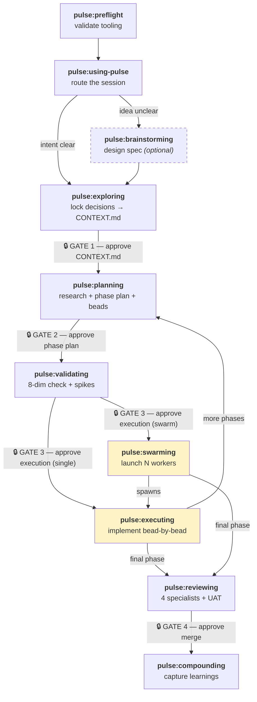

<div align="center">

# Pulse

**A validate-first agentic delivery system for Claude Code and Codex**

[](plugins/pulse/.claude-plugin/plugin.json)
[](docs/legal/terms.md)
[](plugins/pulse/skills)

*Stop agents from hallucinating requirements, skipping verification, and producing unauditable work.*

</div>

---

## What is Pulse?

Pulse wraps AI agents in a **gated delivery chain**. Every decision is locked before planning starts. Every plan is approved before code is written. Every bead of work is verified before it's closed. Every feature is reviewed before it merges.

Without this structure, agents skip steps. With it, they can't.

Pulse ships as **20 skills** — each a `SKILL.md` file loaded into context at invocation. No compiled code. No runtime to install beyond the tools you already use.

---

## Lineage

Pulse is downstream of everal strong agentic-development systems and distills the parts that fit this repo owner's actual workflow:

- **[Khuym](https://github.com/hoangnb24/skills/tree/main)**, which provides most of the validate-first chain and Flywheel-style bead workflow
- **[Superpowers](https://github.com/obra/superpowers)**, which contributes the strongest behavioral discipline around brainstorming, verification, debugging, and skill design
- **[Flywheel](https://agent-flywheel.com/complete-guide)** contributes the operational backbone: beads, `bv`, Agent Mail, swarm execution, and the habit of turning plans into live work graphs instead of loose TODO lists.
- **[Compound Engineering](https://github.com/EveryInc/compound-engineering-plugin)** contributes parallel review, severity-based findings, and the compound-learning loop that feeds future work.
- **[GSD](https://github.com/gsd-build/get-shit-done)** contributes the philosophy: discuss first, research second, plan third, and do not execute until the plan has been verified.

---

## The Delivery Chain



### The 4 Human Gates

Every gate is a hard stop. Nothing proceeds without explicit approval.

| | Gate | Blocks what |
|---|---|---|
| 🔒 **Gate 1** | After exploring | Planning starts |
| 🔒 **Gate 2** | After phase plan | Beads are created |
| 🔒 **Gate 3** | After validating | Code is written |
| 🔒 **Gate 4** | After reviewing | Feature merges (P1 findings block this) |

---

## Skill Catalog

### Core Chain

| Skill | Role |
|-------|------|
| `pulse:preflight` | Checks `git`, `br`, `bv`, and coordination runtime; writes `.pulse/tooling-status.json`; chooses `swarm / single-worker / planning-only / blocked` |
| `pulse:using-pulse` | Session router; manages go-mode, quick mode, micro mode, resume from handoffs, and repo-local Pulse status scouting |
| `pulse:brainstorming` | Turns vague intent into an approved design spec via one-question-at-a-time dialogue |
| `pulse:exploring` | Socratic decision extraction into `history/<feature>/CONTEXT.md`; assigns stable D1, D2... IDs |
| `pulse:planning` | Codebase research → `approach.md` + `phase-plan.md` → bead decomposition |
| `pulse:validating` | 8-dimension plan-checker, spike execution for HIGH-risk items, bead schema gate |
| `pulse:swarming` | Coordinator-only orchestration for parallel workers via Agent Mail |
| `pulse:executing` | Per-bead worker loop: claim → implement → verify → commit → close |
| `pulse:reviewing` | 4 parallel specialist reviewers + learnings synthesizer + artifact verification + UAT |
| `pulse:compounding` | Captures durable learnings into `history/learnings/` with propagation triage |

### Support Skills

| Skill | Role |
|-------|------|
| `pulse:debugging` | Root-cause blocked work; architecture suspicion gate escalates unfixable issues back to planning |
| `pulse:systematic-debug-fix` | Multi-bug tracker discipline: investigate before fixing, verify each fix, regression tests for all |
| `pulse:gkg` | Codebase intelligence via `gkg` tool or `rg` fallback; saves findings to `discovery.md` |
| `pulse:dream` | Consolidates Codex history into durable Pulse learnings with provenance tracking |
| `pulse:ai-multimodal` | Gemini-powered image/audio/video/document processing with bundled scripts |
| `pulse:simplify-code` | 4-lens code review (reuse, quality, efficiency, clarity) with optional safe fixes |
| `pulse:prompt-leverage` | Upgrades raw prompts into structured execution-ready prompts |
| `pulse:writing-pulse-skills` | TDD workshop for creating and improving Pulse skills (RED → GREEN → REFACTOR) |
| `bootstrap-project-context` | Standalone repo-onboarding utility that forces a docs-first, source-grounded architecture pass before implementation |
| `refresh-project-docs` | Standalone docs-sync utility that rewrites README and related docs to match the current repo state in evergreen language |

---

## Key Concepts

### Beads
Work items with a strict schema. Planning creates them, executing closes them.

```
id, title, phase, story
files          ← exact list of files the worker may touch
verify         ← exact commands that must pass before close
verification_evidence ← path where evidence is written
testing_mode   ← standard | tdd-required
risk           ← LOW | MEDIUM | HIGH
dependencies   ← upstream bead IDs
learning_refs  ← relevant learning file paths
decision_refs  ← CONTEXT.md decision IDs (D1, D2...)
```

### Institutional Memory
Learnings flow upward through three propagation paths:

```
global-critical  →  history/learnings/critical-patterns.md  (all future planners read this)
bead-local       →  embedded in bead learning_refs           (workers read at implementation time)
planner-only     →  planning reference only
```

### Context Budget
Any long-running skill writes a handoff and stops at **65% context**. The next session resumes from `.pulse/handoffs/manifest.json` — no work is lost.

### Pipeline Modes

| Mode | When |
|------|------|
| **Full** | Multi-phase feature, swarm available |
| **Single-worker** | Multi-phase feature, no swarm |
| **Quick** | ≤3 files, no HIGH risk, no new API surface |
| **Micro** | Single file, trivial — skips planning/validating/reviewing |
| **Planning-only** | No execution tools available |

---

## Artifact Map

```
.pulse/
  tooling-status.json        ← preflight output
  state.json                 ← machine-readable routing mirror
  STATE.md                   ← shared state
  handoffs/manifest.json     ← resume index
  handoffs/<owner>.json      ← per-actor checkpoints
  verification/<feature>/    ← per-bead execution evidence
  debug-notes/               ← debugging notes → compounding
  dream-pending/             ← ambiguous learnings awaiting approval

history/<feature>/
  CONTEXT.md                 ← locked decisions (source of truth)
  discovery.md               ← codebase research
  approach.md                ← synthesis + risk map
  phase-plan.md              ← whole-feature phase breakdown
  phase-<n>-contract.md      ← phase entry/exit/demo/pivots
  phase-<n>-story-map.md     ← stories → beads mapping

history/learnings/
  critical-patterns.md       ← globally promoted patterns
  YYYYMMDD-<slug>.md         ← individual learning entries

.beads/                      ← bead files (br managed)
.spikes/                     ← spike execution results
```

---

## Requirements

| Tool | Required | Purpose |
|------|----------|---------|
| `git` | Yes | Version control |
| `br` | Yes | Beads CLI — create, update, close, sync work items |
| `bv` | Yes | Beads viewer — TUI + `bv --robot-priority` for worker bead selection |
| Node.js 18+ | Yes | Pulse onboarding script |
| Agent Mail | Swarm only | Worker coordination runtime |
| `gkg` | Optional | Faster codebase intelligence |

Run `pulse:preflight` to check your environment before starting.

---

## Installation

### Claude Code

```bash
# Add the marketplace
/plugin marketplace add quanpersie2001/pulse

# Install all skills at once
/plugin install pulse@pulse
```

Or install individual skills:

```bash
/plugin install pulse:preflight@pulse
/plugin install pulse:using-pulse@pulse
/plugin install pulse:exploring@pulse
# ... etc
```

### Codex

1. Clone this repo
2. Register `.agents/plugins/marketplace.json` as a local marketplace in Codex
3. Install the `pulse` plugin — all 20 skills are discovered automatically

---

## Getting Started

```bash
# 1. Check your environment
pulse:preflight

# 2. Start a session
pulse:using-pulse

# 3. Describe what you want to build — Pulse routes you from there
```

For a full walkthrough, see [`docs/ARCHITECTURE.md`](docs/ARCHITECTURE.md).

If the repo has been onboarded, you can also run `node .codex/pulse_status.mjs --json` for a fast read-only snapshot of Pulse onboarding, state, tooling, and handoff status.

---

## Contributing

See [`plugins/pulse/CONTRIBUTING.md`](plugins/pulse/CONTRIBUTING.md) for skill structure, TDD discipline, naming conventions, versioning, and the PR process.

```bash
# Bump version before opening a PR
./scripts/bump-version.sh minor   # new skill or behavior change
./scripts/bump-version.sh patch   # doc fix or wording
```

---

<div align="center">

MIT License

</div>
