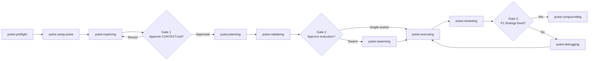

# Pulse

Pulse is a packaged skill plugin for Codex and Claude Code. It turns ambiguous requests into validated, implemented, reviewed, and compounded changes through a gated, bead-driven workflow built around `git`, `br`, `bv`, and optional coordination tooling.

Pulse is downstream of two important upstream systems:

- [Khuym](references/lineage/khuym.md), which provides most of the validate-first chain and Flywheel-style bead workflow
- [Superpowers](references/lineage/superpowers.md), which contributes the strongest behavioral discipline around brainstorming, verification, debugging, and skill design

The plugin does not copy either one verbatim. Pulse keeps the validate-first flow, but adds its own runtime bootstrap, owner-scoped handoffs, stronger bead contracts, review-intake discipline, and debugging escalation rules.

## What Ships

Pulse currently packages:

- 13 Pulse ecosystem skills under [`plugins/pulse/skills/`](plugins/pulse/skills)
- 4 standalone utility skills bundled into the same plugin
- Codex package metadata in [`plugins/pulse/.codex-plugin/plugin.json`](plugins/pulse/.codex-plugin/plugin.json)
- Codex marketplace metadata in [`.agents/plugins/marketplace.json`](.agents/plugins/marketplace.json)
- Claude Code compatibility manifests in [`.claude-plugin/plugin.json`](.claude-plugin/plugin.json) and [`.claude-plugin/marketplace.json`](.claude-plugin/marketplace.json)

The canonical skill source lives in [`plugins/pulse/skills/`](plugins/pulse/skills). The root `.claude-plugin/*.json` files are compatibility wrappers for Claude Code, not a second source of truth.

## Core Workflow

Sessions start with bootstrap, then move through the delivery chain.



The delivery chain itself is still:

```text
pulse:exploring → pulse:planning → pulse:validating → pulse:swarming → pulse:executing(×N) → pulse:reviewing → pulse:compounding
```

The difference is that the delivery chain is always preceded by `pulse:preflight` and `pulse:using-pulse`, and may route through `pulse:debugging` or `pulse:gkg` as support skills.

## Workflow Contracts

These are the core rules the plugin currently enforces:

- Never execute without `pulse:validating`. GATE 2 is mandatory, including quick mode.
- `history/<feature>/CONTEXT.md` is the source of truth for locked product and architectural decisions.
- Runtime readiness is decided by `pulse:preflight`, which writes `.pulse/tooling-status.json` and chooses `swarm`, `single-worker`, `planning-only`, or `blocked`.
- Pause and resume use owner-scoped handoffs under `.pulse/handoffs/`, indexed by `.pulse/handoffs/manifest.json`. Pulse no longer uses a single global `.pulse/HANDOFF.json`.
- Beads are structured contracts, not loose tickets. The canonical schema includes `dependencies`, `files`, `verify`, `verification_evidence`, `testing_mode`, `decision_refs`, and `learning_refs`.
- `testing_mode` supports selective TDD. Only beads marked `tdd-required` must carry explicit red/green steps.
- `pulse:executing` must write substantive verification evidence before a bead is considered close-ready, normally under `.pulse/verification/<feature>/<bead-id>.md`.
- `pulse:reviewing` includes specialist review, artifact verification, review intake, and human UAT. `P1` findings always block merge.
- `pulse:debugging` contains an Architecture Suspicion Gate. If fixes stop converging, the work must go back upstream to planning or validating instead of receiving endless patch attempts.

## Artifact Flow

```text
.pulse/tooling-status.json             <- pulse:preflight
.pulse/STATE.md                        <- shared state across phases
.pulse/handoffs/manifest.json          <- resume index
.pulse/handoffs/*.json                 <- owner-scoped handoff files
history/<feature>/CONTEXT.md           <- exploring
history/<feature>/discovery.md         <- planning research
history/<feature>/approach.md          <- planning synthesis + risk map
.beads/                                <- planning creates, executing closes
.spikes/                               <- validating spike artifacts
.pulse/verification/<feature>/*.md     <- execution evidence
history/learnings/                     <- compounding output
```

## Skill Catalog

### Bootstrap and Meta

| Skill | Purpose |
|-------|---------|
| `pulse:preflight` | Validate tool/runtime readiness, pick execution mode, and write `.pulse/tooling-status.json` |
| `pulse:using-pulse` | Route the session, define go mode, quick mode, pause/resume rules, and shared contracts |
| `pulse:writing-pulse-skills` | Create or improve Pulse skills with a pressure-tested skill-TDD workflow |

### Delivery Chain

| Skill | Purpose |
|-------|---------|
| `pulse:exploring` | Socratic decision extraction into `history/<feature>/CONTEXT.md` |
| `pulse:planning` | Codebase research, approach synthesis, bead decomposition, and learning propagation |
| `pulse:validating` | 8-dimension plan verification, spike execution, and bead polish before execution |
| `pulse:swarming` | Coordinator-only orchestration for multi-worker execution |
| `pulse:executing` | Worker loop with bead scope discipline, selective TDD support, and verification evidence |
| `pulse:reviewing` | Specialist review, artifact verification, review intake, human UAT, and finishing |
| `pulse:compounding` | Durable learning capture and propagation decisions |

### Support Skills

| Skill | Purpose |
|-------|---------|
| `pulse:debugging` | Root-cause debugging for blocked workers, failing verification, and UAT breakage |
| `pulse:gkg` | Codebase intelligence support for architecture snapshots, symbol tracing, and discovery acceleration when `gkg` is available |
| `pulse:dream` | Manual consolidation of Codex artifacts into durable learnings |

### Standalone Skills

| Skill | Purpose |
|-------|---------|
| `ai-multimodal` | Audio, image, video, and document workflows via Gemini plus bundled scripts |
| `prompt-leverage` | Upgrade a raw prompt into a stronger execution-ready prompt |
| `simplify-code` | Parallel review for reuse, clarity, efficiency, and code quality, with optional safe fixes |
| `systematic-debug-fix` | Root-cause-first debugging and regression lock-down outside the main Pulse chain |

## Scoped Memory Model

Pulse keeps worker context intentionally narrow:

- planners search `history/learnings/` and read `critical-patterns.md`
- planners embed only relevant learning file paths into each bead's `learning_refs`
- workers read the learnings referenced by their bead, not the full corpus
- compounding decides whether a new lesson is global, bead-local, or planner-only

## Requirements

| Tool | Required | Purpose |
|------|----------|---------|
| `git` | Yes | Version control |
| `br` | Yes | Beads CLI for create, update, and close |
| `bv` | Yes | Bead viewer and graph inspection |
| Agent Mail or equivalent coordination runtime | Swarm only | Worker orchestration and reservations |
| `gkg` | Optional | Faster structural discovery |
| `gh` | Optional | PR automation |

`pulse:preflight` is the only place that decides whether these are ready enough for the requested mode.

## Installation

### Codex

Add the local repo marketplace from [`.agents/plugins/marketplace.json`](.agents/plugins/marketplace.json), then install the `pulse` plugin package defined by [`plugins/pulse/.codex-plugin/plugin.json`](plugins/pulse/.codex-plugin/plugin.json).

### Claude Code

Use [`.claude-plugin/marketplace.json`](.claude-plugin/marketplace.json) as the marketplace index. Claude Code also reads [`.claude-plugin/plugin.json`](.claude-plugin/plugin.json), which enumerates each skill path explicitly.

## Project Structure

```text
plugins/pulse/
  .codex-plugin/plugin.json
  skills/
    using-pulse/SKILL.md
    preflight/SKILL.md
    exploring/SKILL.md
    planning/SKILL.md
    validating/SKILL.md
    swarming/SKILL.md
    executing/SKILL.md
    reviewing/SKILL.md
    compounding/SKILL.md
    debugging/SKILL.md
    gkg/SKILL.md
    dream/SKILL.md
    writing-pulse-skills/SKILL.md
    ...
.agents/plugins/marketplace.json
.claude-plugin/plugin.json
.claude-plugin/marketplace.json
AGENTS.md
CONTRIBUTING.md
```

## Further Reading

- [Contributing guide](CONTRIBUTING.md)
- [Pulse reference: Khuym lineage](references/lineage/khuym.md)
- [Pulse reference: Superpowers lineage](references/lineage/superpowers.md)
- [Khuym local mirror](references/skills/README.md)
- [Superpowers local mirror](references/superpowers/README.md)

## License

MIT
