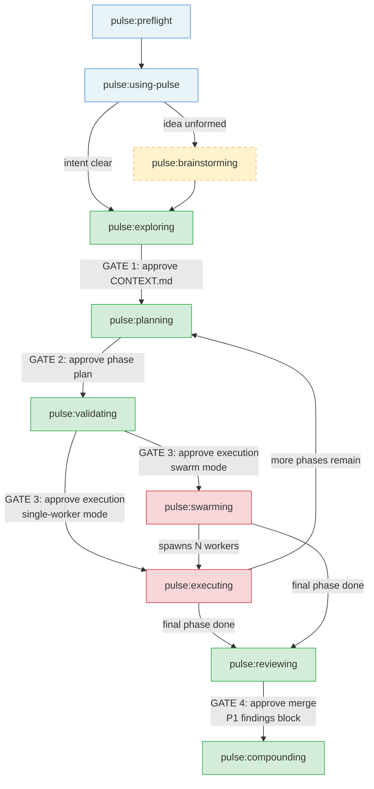
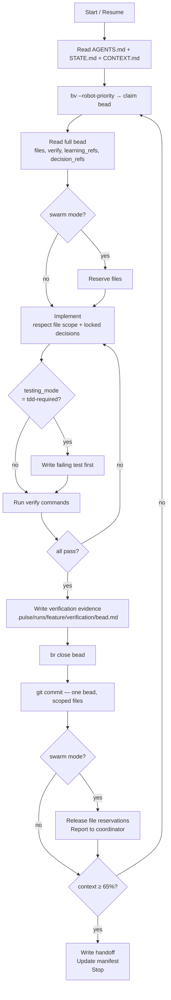
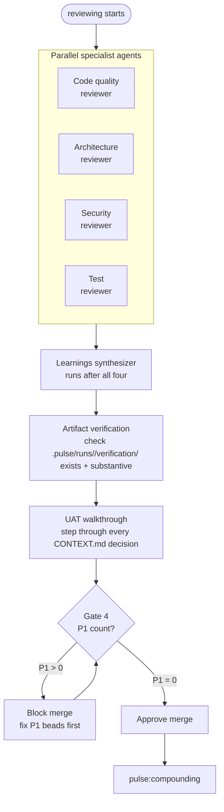
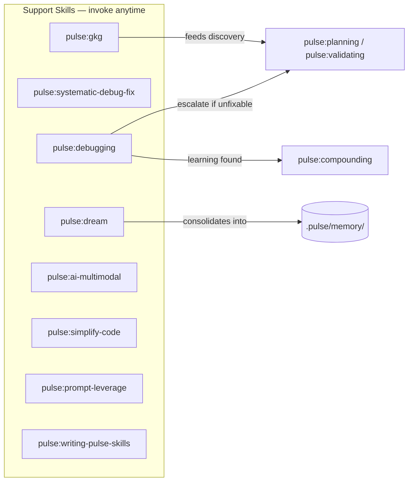
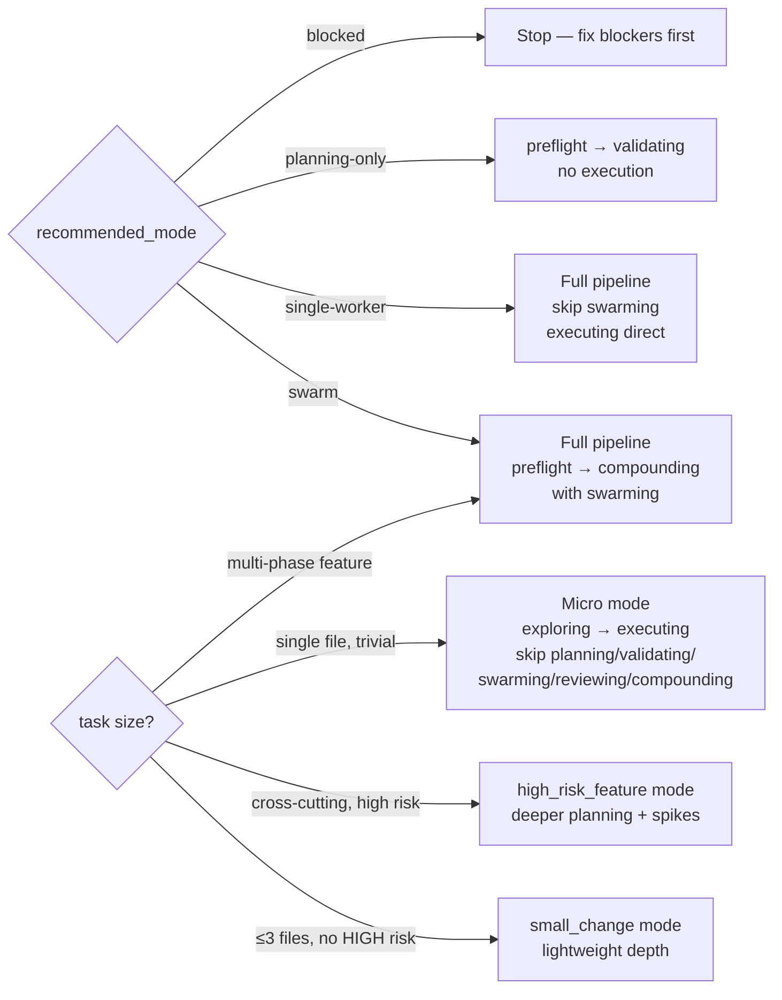

# Pulse Architecture

Pulse is a documentation-centric plugin for Claude Code and Codex. Each skill is a `SKILL.md` file loaded into context at invocation. There is no compiled code — the skill files are the implementation.

## Core Idea

Pulse wraps AI agents in a gated delivery chain. The chain enforces that decisions are locked before planning, planning is approved before execution, and execution is verified before merge. Without this structure, agents skip steps, hallucinate requirements, and produce unverifiable work.

The chain is not optional — every gate is a hard stop requiring explicit human approval.

## Core Principles

Pulse keeps these invariants:

- `CONTEXT.md` is the source of truth for locked decisions.
- `validating` is a real execution gate, not an optional review step.
- beads + `bv` + Agent Mail are the coordination substrate.
- `swarming` is the orchestrator role and `executing` is the worker role.
- `reviewing` and `compounding` are first-class phases, not cleanup afterthoughts.

## Working Modes

Pulse presents three user-facing modes over the same core workflow:

- `small_change` — bounded, low-risk work with lightweight planning and validating
- `standard_feature` — the default full Pulse workflow
- `high_risk_feature` — the full workflow plus deeper planning scrutiny and stronger spike discipline

Modes change the amount of ceremony, not the core contract. `validating` still gates execution in every mode.

---

## Delivery Chain



### The 4 Human Gates

No skill crosses these without explicit user approval:

| Gate | After | Question asked |
|------|-------|----------------|
| **Gate 1** | exploring | "Decisions locked. Approve CONTEXT.md before planning?" |
| **Gate 2** | planning (phase plan) | "Phase breakdown complete. Approve this shape before current-phase prep?" |
| **Gate 3** | validating | "Current phase verified. Approve execution?" |
| **Gate 4** | reviewing | "Review complete. Approve merge?" (blocked if any P1 findings exist) |

---

## Skills Reference

### Phase 0 — Setup

#### `pulse:preflight`
Validates the environment before any Pulse work begins.

- Checks that `git`, `br`, and `bv` are available and reports versions
- Runs `node scripts/onboard_pulse.mjs` to verify or apply repo onboarding (AGENTS.md, `.codex/` hooks, `.pulse/onboarding.json`)
- Checks coordination runtime health (determines swarm vs single-worker capability)
- Writes `.pulse/tooling-status.json` with outcome and `recommended_mode`
- Maintains `.pulse/state.json` as a lightweight machine-readable routing mirror
- **Modes:** `swarm`, `single-worker`, `planning-only`, `blocked`
- **Hard rule:** Never proceeds past FAIL. All downstream skills depend on this artifact.

**Outputs:** `.pulse/tooling-status.json`, `.pulse/state.json`, `.pulse/STATE.md`

---

#### `pulse:using-pulse`
The routing brain. Loaded after preflight on every session.

- Reads `tooling-status.json` and `STATE.md` to understand current context
- Uses `node .codex/pulse_status.mjs --json` as a fast read-only scout when the repo is onboarded
- Presents the skill catalog and routes the user's intent to the correct first skill
- Manages go-mode (full pipeline, 4 gates), working modes (`small_change` / `standard_feature` / `high_risk_feature`), micro mode (single-file trivial tasks)
- Handles resume: reads `.pulse/handoffs/manifest.json`, presents active handoffs, asks which to resume
- Maintains the default communication contract (plain-language summaries, no jargon without translation)

**Routing table (abbreviated):**

| Request type | First skill |
|---|---|
| Idea is vague / design unclear | `pulse:brainstorming` |
| Feature intent clear, decisions fuzzy | `pulse:exploring` |
| Decisions already locked | `pulse:planning` |
| "Review my code" | `pulse:reviewing` |
| Agent blocked or failing | `pulse:debugging` |
| "What is the architecture?" | `pulse:gkg` |
| "Improve Pulse itself" | `pulse:writing-pulse-skills` |

---

### Phase 1 — Design (Optional)

#### `pulse:brainstorming`
Turns vague intent into an approved design spec before any decisions are locked.

- Asks clarifying questions **one at a time** — hard gate between each
- Proposes 2–3 distinct approaches with trade-offs after sufficient context
- Presents a recommended design; iterates on feedback
- Writes the agreed spec to `history/<feature>/spec.md`
- Spawns a spec self-review subagent (see `references/spec-reviewer-prompt.md`) before handing off
- **Hard rule:** No code, no beads, no file writes until the spec is approved by the user

**Outputs:** `history/<feature>/spec.md`  
**Next skill:** `pulse:exploring`

---

### Phase 2 — Exploring

#### `pulse:exploring`
Locks all implementation decisions before planning begins.

- Classifies scope (quick / standard / deep) and domain (SEE / CALL / RUN / READ / ORGANIZE)
- Asks Socratic questions **one at a time** — each question must be answered before the next
- Assigns stable decision IDs: D1, D2, D3... as decisions are locked
- Writes the locked decisions to `history/<feature>/CONTEXT.md`
- Spawns a self-review subagent before Gate 1
- **Hard rule:** No planning, no code, no beads until CONTEXT.md is approved

**Inputs:** User intent, `references/gray-area-probes.md`, `references/context-template.md`  
**Outputs:** `history/<feature>/CONTEXT.md`  
**Next skill:** `pulse:planning`

---

## Runtime State Artifacts

Pulse uses both human-readable and machine-readable runtime state:

```text
.pulse/
  tooling-status.json   -> preflight result and recommended mode
  state.json            -> lightweight routing/status mirror
  STATE.md              -> human-readable current phase and focus
  handoffs/manifest.json -> owner-scoped resume index
```

Rules:
- `state.json` is a convenience mirror, not the source of truth for planning artifacts
- `STATE.md` remains the narrative status file
- handoff manifests remain owner-scoped and are not replaced by a global handoff file
- `node .codex/pulse_status.mjs --json` is a read-only scout, not a workflow gate

---

### Phase 3 — Planning

#### `pulse:planning`
Researches the codebase and produces the full execution plan.

Works in two sub-phases:

**Sub-phase A — Whole-feature plan (ends at Gate 2):**
1. Reads `CONTEXT.md` and `.pulse/memory/critical-patterns.md`
2. Warns if institutional memory is stale (>3 features since last compounding)
3. Runs codebase discovery (architecture, patterns, constraints; optionally via `pulse:gkg`)
4. Writes `history/<feature>/discovery.md` and `approach.md` (includes risk map and spike questions for HIGH-risk items)
5. Writes `history/<feature>/phase-plan.md` — whole-feature phase breakdown
6. **Gate 2:** presents phase plan and waits for approval

**Sub-phase B — Current-phase preparation (after Gate 2 approval):**
7. Writes `phase-<n>-contract.md` (entry/exit state, demo, unlocks, pivot signals)
8. Writes `phase-<n>-story-map.md` (story sequence mapped to beads)
9. Creates bead files in `.beads/` using `br` with full canonical schema

**Bead schema (required fields):** `id`, `title`, `phase`, `story`, `files`, `verify`, `verification_evidence`, `testing_mode`, `risk`, `dependencies`, `learning_refs`, `decision_refs`

**Outputs:** `discovery.md`, `approach.md`, `phase-plan.md`, `phase-<n>-contract.md`, `phase-<n>-story-map.md`, `.beads/`  
**Next skill:** `pulse:validating`

---

### Phase 4 — Validating

#### `pulse:validating`
Proves the current phase is actually ready to execute before anyone starts writing code.

1. **Schema gate** — scans all beads for missing required fields
2. **Plan-checker** — 8-dimension structural review (completeness, consistency, scope, risk, dependencies, verification, contract alignment, story coverage); max 3 iterations
3. **Spike execution** — for every HIGH-risk item, creates a spike bead, executes it, and records a yes/no answer; a failed spike halts the pipeline and sends back to planning
4. **Bead polishing** — `bv --robot-*` passes to normalize and improve bead quality
5. **Fresh-eyes review** — subagent review of the full plan
6. **Gate 3** — presents exit state, story/bead counts, risk summary, spike results; requires explicit user approval

**Hard rule:** Never skip validating, even for "obvious" plans or small changes.

**Inputs:** All planning artifacts, `.beads/`, `references/plan-checker-prompt.md`, `references/bead-reviewer-prompt.md`  
**Outputs:** Validated bead graph, `.spikes/` results, `.pulse/STATE.md` updated  
**Next skill:** `pulse:swarming` (swarm mode) or `pulse:executing` (single-worker mode)

---

### Phase 5 — Execution

#### `pulse:swarming`
Orchestrates parallel worker agents. Runs only when `recommended_mode=swarm`.

- Initializes the coordination runtime (registers project, agent names, epic thread)
- Spawns bounded worker subagents — each loads `pulse:executing`
- Runs a continuous monitor loop: `fetch_inbox` → `fetch_topic` → act (reassign blocked work, resolve file conflicts, broadcast state)
- Implements a silence ladder for idle workers (poke → reassign → spawn replacement)
- **Hard rule:** Never implements beads directly. The coordinator only orchestrates.

**Outputs:** Coordinator handoff (`.pulse/handoffs/coordinator.json`), updated `STATE.md`  
**Next skill (after all phases complete):** `pulse:reviewing`

---

#### `pulse:executing`
The implementation worker. Runs either under swarming or directly in single-worker mode.



**Hard rules:** One commit per bead. Never modify files outside bead's `files` list. Never close a bead without substantive verification evidence.

**Outputs:** Committed code, active `.pulse/runs/<feature>/verification/` evidence, closed beads  
**Next:** Loop back to planning for subsequent phases; `pulse:reviewing` after final phase

---

### Phase 6 — Reviewing

#### `pulse:reviewing`
Quality gate before merge. Runs after the final execution phase.



Each finding becomes a review bead with severity:
- **P1** — blocks merge; must be fixed before Gate 4
- **P2** — should fix; tracked but doesn't block
- **P3** — advisory; can defer

Also runs:
- **Artifact verification** — confirms active `.pulse/runs/<feature>/verification/` files exist and are substantive
- **UAT walkthrough** — steps through every decision in `CONTEXT.md` and confirms implementation matches

**Gate 4:** presents P1/P2/P3 counts; P1 > 0 blocks merge.

**Outputs:** Review beads, artifact verification results, UAT outcome  
**Next skill:** `pulse:compounding`

---

### Phase 7 — Compounding

#### `pulse:compounding`
Captures durable learnings from the completed feature into the institutional knowledge base.

Spawns 3 parallel analysis subagents:
1. **Pattern extractor** — what recurring solutions emerged?
2. **Decision analyst** — which decisions turned out to be right/wrong and why?
3. **Failure analyst** — what broke, and what would have prevented it?

Each learning is classified and written to `.pulse/memory/learnings/YYYYMMDD-<slug>.md` with:
- `domain`, `severity`, `applicable_when`, `propagation` metadata
- One of three propagation paths:
  - `global-critical` → promoted to `.pulse/memory/critical-patterns.md` (used by all future planners)
  - `bead-local` → embedded in relevant bead types via `learning_refs`
  - `planner-only` → planning reference only, not bead-level

**Hard rule:** Only genuinely global, non-obvious patterns are promoted to `.pulse/memory/critical-patterns.md`. Not everything learned from a single feature belongs there.

**Outputs:** `.pulse/memory/learnings/*.md`, (selective) updates to `.pulse/memory/critical-patterns.md`, `STATE.md` updated with `last_compounding_run`

---

## Support Skills

These skills operate outside the main chain and are invoked on demand.

Standalone utilities also ship outside the core chain:
- `bootstrap-project-context` for docs-first, source-grounded repo onboarding
- `refresh-project-docs` for syncing README and related docs to the current repo state in evergreen language



### `pulse:debugging`
Root-causes blocked work, failing tests, and runtime breakage.

1. Classify issue type (build / test / runtime / integration / coordination blocker)
2. Check bead's `learning_refs` first — before any global search
3. Reproduce the failure with the exact command that caused it
4. Trace to a single root cause sentence
5. Implement fix; verify it eliminates the failure
6. Write `.pulse/debug-notes/<bead-id>-debug.md`
7. Recommend compounding if learning is durable

**Architecture suspicion gate:** If fixes stop converging or the failure hops subsystems, stop patching and escalate back to `pulse:planning` or `pulse:validating`.

---

### `pulse:systematic-debug-fix`
Multi-bug investigation with tracker discipline. Used when multiple known issues need to be resolved systematically.

1. Creates an issue tracker (IDs, symptoms, status) before touching any code
2. For each bug: write hypothesis → reproduce → trace root cause → then fix
3. Fixes applied one at a time, verified individually
4. Regression tests added for every fixed bug
5. Tracks status across all issues throughout

**Hard rule:** No fix without prior investigation. No batch-fixing multiple bugs simultaneously.

---

### `pulse:gkg`
Codebase intelligence via scout-first gkg MCP discovery (or `rg` fallback).

- Checks `node .codex/pulse_status.mjs --json` before discovery work
- Uses MCP tools like `repo_map`, `search_codebase_definitions`, and `read_definitions` as the primary path
- Treats `get_references` and `get_definition` as helper-only tools, not the backbone of discovery
- Falls back to `rg` + file reads when gkg is unavailable or the repo is unsupported, and documents the fallback
- Saves findings to `history/<feature>/discovery.md`
- Used as a support skill during planning and exploring — not a worker skill

---

### `pulse:dream`
Manual consolidation of durable learnings from Codex artifacts into Pulse memory.

- Detects **bootstrap mode** (first run — no provenance markers) vs **recurring mode**
- Reads Codex history (`~/.codex/history.jsonl`) and applies the consolidation rubric
- Classifies each candidate: `match` (updates existing learning), `ambiguous` (stored in `dream-pending/` for user approval), `no-match` (creates new learning file), `no durable signal` (discarded)
- Writes provenance markers to all files it touches
- **Hard rule:** Never edits `critical-patterns.md` without explicit user approval

---

### `pulse:ai-multimodal`
Gemini-powered media processing.

- Checks `GEMINI_API_KEY` before any operation
- Uses bundled scripts: `gemini_batch_process.py`, `media_optimizer.py`, `document_converter.py`
- Supports: image analysis/OCR, audio transcription, video analysis, document extraction, media generation
- Handles rate limits with auto key rotation (60s cooldown between rotations)
- Outputs structured results (JSON/Markdown/CSV) consumable by executing as verification evidence

---

### `pulse:simplify-code`
Code review and simplification across four lenses.

Three modes:
- **review-only** — reports findings, no file changes
- **safe-fixes** — applies high-confidence behavior-preserving changes
- **fix-and-validate** — applies fixes and runs validation commands

Spawns 4 parallel review subagents: **reuse**, **quality**, **efficiency**, **clarity**. Aggregates into a structured findings list with `file`, `line`, `category`, `recommended fix`.

**Hard rule:** In review-only mode, zero file modifications.

---

### `pulse:prompt-leverage`
Upgrades weak prompts into structured, execution-ready prompts.

Framework blocks applied as needed:
- **Objective** — what to accomplish
- **Context** — relevant background
- **Work Style** — how to approach the task
- **Tool Rules** — which tools to use or avoid
- **Output Contract** — format and content of the result
- **Verification** — how to check the output is correct
- **Done Criteria** — when to stop

Preserves original intent; adds structure proportionally to task complexity. Does not over-specify simple tasks.

---

### `pulse:writing-pulse-skills`
TDD workshop for creating and improving Pulse skills.

Uses the Iron Law: **write a failing test before writing the skill**.

**RED phase:**
1. Define the skill's purpose and pressure scenarios
2. Run each scenario without the skill — record the rationalizations the model produces to avoid doing the right thing
3. Capture the rationalization table

**GREEN phase:**
4. Write a minimal SKILL.md that directly addresses each recorded rationalization
5. Re-run all pressure scenarios with the skill loaded — all must pass

**REFACTOR:**
6. Trim anything not needed to pass the tests

Documents the full process in `CREATION-LOG.md`.

---

## State and Artifacts

```mermaid
flowchart TD
    subgraph pulse[.pulse/]
        TS[tooling-status.json]
        SM[STATE.md]
        MF[handoffs/manifest.json]
        HF[handoffs/owner.json]
        VE[verification/feature/]
        DN[debug-notes/]
        DP[dream-pending/]
    end

    subgraph history[history/feature/]
        CTX[CONTEXT.md\nlocked decisions]
        DISC[discovery.md]
        APP[approach.md]
        PP[phase-plan.md]
        PC[phase-n-contract.md]
        PSM[phase-n-story-map.md]
    end

    subgraph learnings[.pulse/memory/]
        CP[critical-patterns.md]
        LF[learnings/YYYYMMDD-slug.md]
    end

    subgraph work[work items]
        BD[.beads/]
        SP[.spikes/]
    end

    preflight --> TS
    preflight --> SM
    exploring --> CTX
    planning --> DISC & APP & PP & PC & PSM & BD
    validating --> SP
    executing --> VE
    debugging --> DN
    reviewing --> BD
    compounding --> LF
    compounding -->|global only| CP
    dream --> LF
    dream --> DP
```



### Shared state files

```
.pulse/
  STATE.md                    — active feature, phase, last updated, worker tracking
  config.json                 — feature toggles
  tooling-status.json         — preflight output (required before any execution)
  handoffs/
    manifest.json             — index of all active pause/resume entries
    planning.json             — planning checkpoint
    coordinator.json          — swarm coordinator checkpoint
    worker-<agent>.json       — per-worker checkpoint
    single-worker.json        — single-worker checkpoint
  verification/<feature>/     — per-bead execution evidence
  debug-notes/                — debugging debug notes (input to compounding)
  dream-pending/              — ambiguous dream decisions awaiting approval
```

### Feature history

```
history/<feature>/
  CONTEXT.md                  — locked decisions (source of truth)
  discovery.md                — codebase research findings
  approach.md                 — synthesis, risk map, spike questions
  phase-plan.md               — whole-feature phase breakdown
  phase-<n>-contract.md       — phase entry/exit state, demo, unlocks, pivot signals
  phase-<n>-story-map.md      — stories mapped to beads within the phase
```

### Institutional knowledge

```
.pulse/memory/
  critical-patterns.md        — globally applicable learnings (promoted conservatively)
  learnings/
    YYYYMMDD-<slug>.md        — individual learning entries with domain/severity/propagation
  corrections/
  ratchet/
```

### Work items

```
.beads/                       — bead files (created by planning, closed by executing)
.spikes/                      — spike execution results (created by validating)
```

---

## Key Tools

| Tool | Binary | Purpose |
|------|--------|---------|
| Beads CLI | `br` | Create, update, close, sync beads |
| Beads viewer | `bv` | TUI inspection; `bv --robot-priority` for machine-readable priority queue |
| GKG | `gkg` | Optional codebase intelligence (map, search, refs, definitions) |
| Agent Mail | — | Swarm coordination runtime (coordinator ↔ workers) |
| Onboarding | `node scripts/onboard_pulse.mjs` | Installs/updates repo-level Pulse config |

---

## Startup Contract

On normal Pulse sessions:

1. Read `AGENTS.md`
2. If present, run `node .codex/pulse_status.mjs --json`
3. Read `.pulse/handoffs/manifest.json` if resuming
4. Read `.pulse/state.json`
5. Read `.pulse/STATE.md`
6. Re-open the active feature `CONTEXT.md`
7. Read `.pulse/memory/critical-patterns.md` before planning or execution when it exists

---

## Pipeline Modes



| Mode | When | What's skipped |
|------|------|----------------|
| **Full (go mode)** | Any multi-phase feature | Nothing |
| **Swarm** | `recommended_mode=swarm` | `pulse:executing` runs under `pulse:swarming` |
| **Single-worker** | `recommended_mode=single-worker` | `pulse:swarming` skipped; `pulse:executing` runs directly |
| **Small change (`small_change`)** | ≤3 files, no new API surface, no HIGH risk | Planning/validating/reviewing use lightweight depth |
| **High risk (`high_risk_feature`)** | Cross-cutting or architecture-sensitive work | Deeper planning, stronger spike discipline |
| **Micro** | Single file, 1-2 beads, no decisions | Skips planning, validating, swarming, reviewing, compounding; user must confirm |
| **Planning-only** | `recommended_mode=planning-only` | Execution cannot start |
| **Blocked** | `recommended_mode=blocked` | Everything halted until blockers cleared |

---

## Context Budget

Every long-running skill tracks context usage. At **65%** the current actor writes a handoff and stops.

```mermaid
sequenceDiagram
    participant Actor as Current skill
    participant MF as handoffs/manifest.json
    participant NS as New session

    Actor->>Actor: context reaches 65%
    Actor->>MF: write owner handoff file
    Actor->>MF: update manifest entry
    Actor->>Actor: stop

    NS->>MF: read manifest (active entries)
    MF-->>NS: list: owner, skill, feature, phase, next action
    NS->>NS: ask user which handoff to resume
    NS->>Actor: load named skill, continue from handoff
```

On resume, `pulse:using-pulse` reads the manifest and presents active handoffs for the user to choose from. The new session loads the named skill and continues from the handoff file.

---

## Verification Expectations

Public-doc changes in this repo should pass:

```bash
bash scripts/check-markdown-links.sh
bash scripts/sync-skills.sh --dry-run
```
