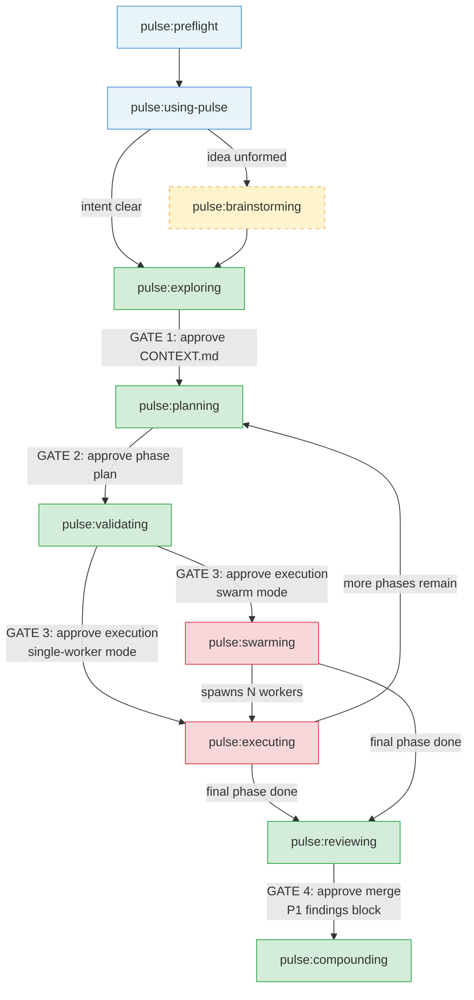
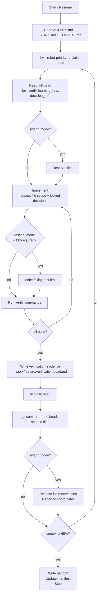
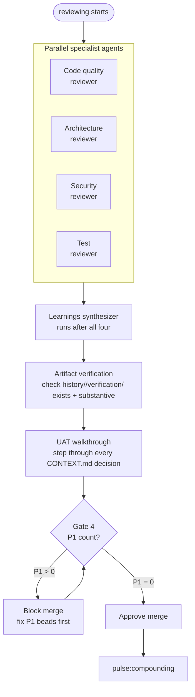
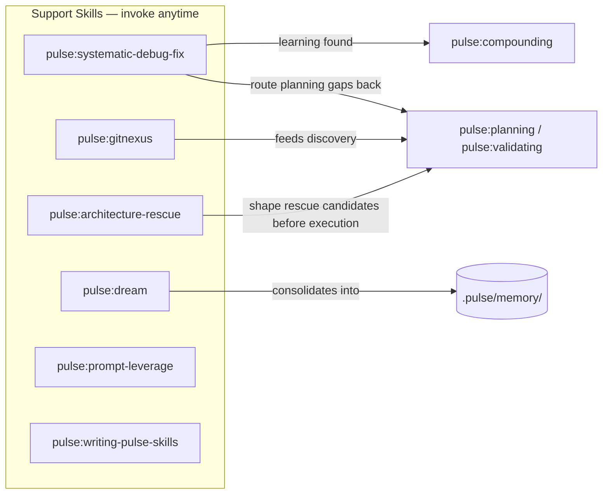
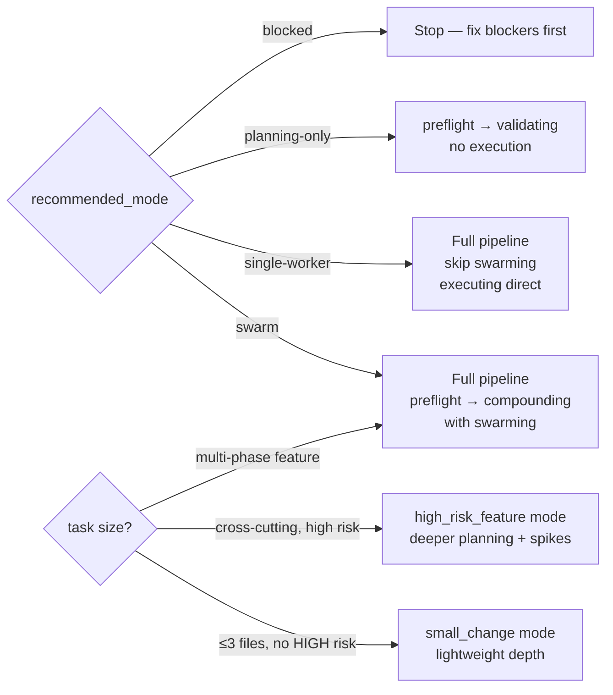

# Pulse Architecture

Pulse is a documentation-centric plugin for Claude Code and Codex. The workflow contract lives in `SKILL.md` files loaded into context at invocation, while repo-local Node helpers provide onboarding, state sync, dependency checks, and local coordination. Pulse is documentation-centric, not documentation-only.

## Core Idea

Pulse wraps AI agents in a gated delivery chain. The chain enforces that decisions are locked before planning, planning is approved before execution, and execution is verified before merge. Without this structure, agents skip steps, hallucinate requirements, and produce unverifiable work.

The chain is not optional — every gate is a hard stop requiring explicit human approval.

## Documentation plane vs local control plane

Pulse has two cooperating layers:

- **Documentation plane** — `SKILL.md` files define gates, routing, artifacts, and operator-facing workflow behavior.
- **Local control plane** — repo-local Node helpers implement onboarding/remediation, state mirrors, dependency reporting, scout/status surfaces, and local coordination helpers such as reservations.

The control plane supports the skill contract; it does not replace or supersede it.

## Core Principles

Pulse keeps these invariants:

- `SKILL.md` remains the primary workflow contract even when Node helpers provide runtime support.
- `CONTEXT.md` is the source of truth for locked decisions.
- repo-level project docs remain a separate truth plane for durable terminology and architecture context.
- `validating` is a real execution gate, not an optional review step.
- beads + `bv` + runtime-native swarm adapters + local reservations are the coordination substrate.
- `swarming` is the orchestrator role and `executing` is the worker role.
- `reviewing` and `compounding` are first-class phases, not cleanup afterthoughts.

## Working Modes

Pulse presents three user-facing modes over the same core workflow:

- `small_change` — bounded, low-risk fixes, local refactors, and non-feature adjustments with lightweight planning and validating
- `standard_feature` — the default full Pulse workflow for all new features and normal refactors
- `high_risk_feature` — the full workflow plus deeper planning scrutiny and stronger spike discipline for cross-cutting or architecture-sensitive features

Modes change the amount of ceremony, not the core contract. `validating` still gates execution in every mode.

`Micro Mode` is not a separate working mode in this model. It is a tightly scoped shortcut exception defined by `pulse:using-pulse` for genuinely trivial non-feature work that does not justify even `small_change`.

## Foundation-first feature design

Pulse does not frame new features as MVPs, prototype subsets, or temporary architecture. For feature work, the system shape comes first: enduring foundations, module ownership, interfaces, and boundaries that let each module evolve and optimize independently.

Feature delivery may still happen in phases, but the narrowness belongs to execution scope, not to product ambition or architectural thinking. A first phase can be small; the architecture may not be disposable.

---

## Delivery Chain



### The 4 Human Gates

No skill crosses these without explicit user approval:

| Gate | After | Question asked |
|------|-------|----------------|
| **Gate 1** | exploring | "Decisions locked. Approve CONTEXT.md before planning?" |
| **Gate 2** | planning (phase plan) | "Phase breakdown complete. Approve this shape before current-phase prep?" |
| **Gate 3** | validating | "Current phase verified. Approve execution?" |
| **Gate 4** | reviewing | "Review complete. Approve merge?" (blocked if any P1 findings exist) |

---

## Skills Reference

### Phase 0 — Setup

#### `pulse:preflight`
Sole authority for onboarding, tool-health, and readiness before any Pulse work begins.

- Checks that `git`, `br`, and `bv` are available and reports versions
- Runs `node skills/using-pulse/scripts/onboard_pulse.mjs --repo-root <repo-root>` to assess repo onboarding/remediation state for `AGENTS.md`, repo-local Pulse runtime helpers under `.pulse/scripts/`, repo-local Pulse state under `.pulse/`, legacy `.codex/hooks.json` cleanup, legacy `.codex/hooks/*` and `.codex/pulse_*.mjs` cleanup, and `.pulse/onboarding.json`
- Applies onboarding or remediation changes only after explicit approval, using `--apply` when remediation is needed
- Checks native runtime swarm capability and reservation-helper readiness (determines swarm vs single-worker capability)
- Writes `.pulse/tooling-status.json` with outcome and `recommended_mode`
- Maintains `.pulse/state.json` as a lightweight machine-readable routing mirror
- **Modes:** `swarm`, `single-worker`, `planning-only`, `blocked`
- **Hard rule:** Never proceeds past FAIL. All downstream skills depend on this artifact.
- **Authority boundary:** Preflight is the only skill that may establish or refresh onboarding/readiness status artifacts.

**Outputs:** `.pulse/tooling-status.json`, `.pulse/state.json`, `.pulse/STATE.md`

---

#### `pulse:using-pulse`
Router/scout only. Loaded after preflight on every session.

- Reads `tooling-status.json` and `STATE.md` to understand current context
- Uses `node .pulse/scripts/pulse_status.mjs --json` as a fast read-only scout when the repo is onboarded
- Defers to `pulse:preflight` whenever onboarding/readiness artifacts are missing, stale, or contradictory
- Presents the skill catalog and routes the user's intent to the correct first skill
- Manages go-mode (full pipeline, 4 gates), working modes (`small_change` / `standard_feature` / `high_risk_feature`), micro mode (single-file trivial tasks)
- Handles resume: reads `.pulse/handoffs/manifest.json`, presents active handoffs, asks which to resume
- Maintains the default communication contract (plain-language summaries, no jargon without translation)

**Routing table (abbreviated):**

| Request type | First skill |
|---|---|
| Idea is vague / design unclear | `pulse:brainstorming` |
| Feature intent clear, decisions fuzzy | `pulse:exploring` |
| Decisions already locked | `pulse:planning` |
| "Review my code" | `pulse:reviewing` |
| Agent blocked or failing | `pulse:systematic-debug-fix` |
| "What is the architecture?" | `pulse:gitnexus` |
| "Improve Pulse itself" | `pulse:writing-pulse-skills` |

---

### Phase 1 — Design (Optional)

#### `pulse:brainstorming`
Turns vague intent into an approved design spec before any decisions are locked.

- Asks clarifying questions **one at a time** — hard gate between each
- Prefers source-backed answers over avoidable user questions
- Includes a recommended default when the repo or current context makes one strong
- Proposes 2–3 distinct approaches with trade-offs after sufficient context
- Presents a recommended design; iterates on feedback
- Writes the agreed spec to `history/<feature>/spec.md`
- Uses local support assets directly (`references/spec-reviewer-prompt.md`, `references/visual-support-guidance.md`, `evals/`) when needed
- Spawns a spec self-review subagent before handing off
- **Hard rule:** No code, no beads, no file writes until the spec is approved by the user

**Outputs:** `history/<feature>/spec.md`  
**Next skill:** `pulse:exploring`

---

### Phase 2 — Exploring

#### `pulse:exploring`
Locks all implementation decisions before planning begins.

- Classifies scope (quick / standard / deep) and domain (SEE / CALL / RUN / READ / ORGANIZE)
- Asks Socratic questions **one at a time** — each question must be answered before the next
- Reuses repo-level glossary when present and surfaces term conflicts immediately
- Uses concrete scenarios to force precise boundaries when language is still fuzzy
- Assigns stable decision IDs: D1, D2, D3... as decisions are locked
- Writes the locked decisions to `history/<feature>/CONTEXT.md`
- Spawns a self-review subagent before Gate 1
- **Hard rule:** No planning, no code, no beads until CONTEXT.md is approved

**Inputs:** User intent, `references/gray-area-probes.md`, `references/context-template.md`  
**Outputs:** `history/<feature>/CONTEXT.md`  
**Next skill:** `pulse:planning`

---

## Runtime State Artifacts

Pulse uses both human-readable and machine-readable runtime state:

```text
.pulse/
  tooling-status.json   -> preflight result and recommended mode
  state.json            -> lightweight routing/status mirror
  STATE.md              -> human-readable current phase and focus
  project-docs.json     -> routing map for repo-level CONTEXT/CONTEXT-MAP/ADR docs
  handoffs/manifest.json -> owner-scoped resume index
```

Rules:
- checkpoint authority order is: active handoff manifest → selected owner handoff file → current state mirrors (`state.json`, `STATE.md`)
- checkpoints are advisory snapshots; they do not override handoff authority
- `state.json` is a convenience mirror, not the source of truth for planning artifacts
- `STATE.md` remains the narrative status file
- handoff manifests remain owner-scoped and are not replaced by a global handoff file
- `node .pulse/scripts/pulse_status.mjs --json` is a read-only scout, not a workflow gate
- if readiness/onboarding status is unclear, control returns to `pulse:preflight` rather than being inferred by `pulse:using-pulse`

---

### Phase 3 — Planning

#### `pulse:planning`
Researches the codebase and produces the full execution plan.

Works in two sub-phases:

**Sub-phase A — Whole-feature plan (ends at Gate 2):**
1. Reads `CONTEXT.md` and `.pulse/memory/critical-patterns.md`
2. Warns if institutional memory is stale (>3 features since last compounding)
3. Runs codebase discovery (architecture, patterns, constraints; preferably via `pulse:gitnexus` when configured)
4. Writes `history/<feature>/discovery.md` and `approach.md` (includes risk map and spike questions for HIGH-risk items)
5. Writes `history/<feature>/phase-plan.md` — whole-feature phase breakdown
6. **Gate 2:** presents phase plan and waits for approval

**Sub-phase B — Current-phase preparation (after Gate 2 approval):**
7. Writes `phase-<n>-contract.md` (entry/exit state, demo, unlocks, pivot signals)
8. Writes `phase-<n>-story-map.md` (story sequence mapped to beads)
9. Creates bead files in `.beads/` using `br` with full canonical schema

**Bead schema (required fields):** `id`, `title`, `phase`, `story`, `files`, `verify`, `verification_evidence`, `testing_mode`, `risk`, `dependencies`, `learning_refs`, `decision_refs`

**Outputs:** `discovery.md`, `approach.md`, `phase-plan.md`, `phase-<n>-contract.md`, `phase-<n>-story-map.md`, `.beads/`  
**Next skill:** `pulse:validating`

---

### Phase 4 — Validating

#### `pulse:validating`
Proves the current phase is actually ready to execute before anyone starts writing code.

1. **Schema gate** — scans all beads for missing required fields
2. **Plan-checker** — 8-dimension structural review (completeness, consistency, scope, risk, dependencies, verification, contract alignment, story coverage); max 3 iterations
3. **Spike execution** — for every HIGH-risk item, creates a spike bead, executes it, and records a yes/no answer; a failed spike halts the pipeline and sends back to planning
4. **Bead polishing** — `bv --robot-*` passes to normalize and improve bead quality
5. **Fresh-eyes review** — subagent review of the full plan
6. **Gate 3** — presents exit state, story/bead counts, risk summary, spike results; requires explicit user approval

**Hard rule:** Never skip validating, even for "obvious" plans or small changes.

**Inputs:** All planning artifacts, `.beads/`, `references/plan-checker-prompt.md`, `references/bead-reviewer-prompt.md`  
**Outputs:** Validated bead graph, `.spikes/` results, `.pulse/STATE.md` updated  
**Next skill:** `pulse:swarming` (swarm mode) or `pulse:executing` (single-worker mode)

---

### Phase 5 — Execution

#### `pulse:swarming`
Orchestrates parallel worker agents. Runs only when `recommended_mode=swarm`.

- Adapts the shared swarm contract to the active runtime: Claude Code teammates or Codex native subagents
- Spawns bounded workers — each loads `pulse:executing`
- Runs a continuous monitor loop over the active coordination surface plus the live bead graph
- Resolves file conflicts through `.pulse/scripts/pulse_reservations.mjs` and shared Pulse state
- Implements a silence ladder for idle workers (remind → recover → escalate)
- **Hard rule:** Never implements beads directly. The coordinator only orchestrates.

**Outputs:** Coordinator handoff (`.pulse/handoffs/coordinator.json`), updated `STATE.md`  
**Next skill (after all phases complete):** `pulse:reviewing`

---

#### `pulse:executing`
The implementation worker. Runs either under swarming or directly in single-worker mode.

For compact runtime details that were moved out of top-level docs, see `skills/executing/references/runtime-appendix.md`.



**Hard rules:** One commit per bead. Never modify files outside bead's `files` list. Never close a bead without substantive verification evidence.

**Outputs:** Committed code, canonical `history/<feature>/verification/` evidence, closed beads  
**Next:** Loop back to planning for subsequent phases; `pulse:reviewing` after final phase

---

### Phase 6 — Reviewing

#### `pulse:reviewing`
Quality gate before merge. Runs after the final execution phase.



Each finding becomes a review bead with severity:
- **P1** — blocks merge; must be fixed before Gate 4
- **P2** — should fix; tracked but doesn't block
- **P3** — advisory; can defer

Also runs:
- **Artifact verification** — confirms canonical `history/<feature>/verification/` files exist and are substantive
- **UAT walkthrough** — steps through every decision in `CONTEXT.md` and confirms implementation matches

**Gate 4:** presents P1/P2/P3 counts; P1 > 0 blocks merge.

**Outputs:** Review beads, artifact verification results, UAT outcome  
**Next skill:** `pulse:compounding`

---

### Phase 7 — Compounding

#### `pulse:compounding`
Captures post-cycle, machine-readable learnings from the completed feature into the institutional knowledge base.

Spawns 3 parallel analysis subagents:
1. **Pattern extractor** — what recurring solutions emerged?
2. **Decision analyst** — which decisions turned out to be right/wrong and why?
3. **Failure analyst** — what broke, and what would have prevented it?

Each learning is classified and written to `.pulse/memory/learnings/YYYYMMDD-<slug>.md` with:
- `domain`, `severity`, `applicable_when`, `propagation` metadata
- One of three propagation paths:
  - `global-critical` → promoted to `.pulse/memory/critical-patterns.md` (used by all future planners)
  - `bead-local` → embedded in relevant bead types via `learning_refs`
  - `planner-only` → planning reference only, not bead-level

**Hard rule:** Only genuinely global, non-obvious patterns are promoted to `.pulse/memory/critical-patterns.md`. Not everything learned from a single feature belongs there.

**Outputs:** `.pulse/memory/learnings/*.md`, (selective) updates to `.pulse/memory/critical-patterns.md`, `STATE.md` updated with `last_compounding_run`

---

## Support Skills

These skills operate outside the main chain and are invoked on demand.

Standalone utilities also ship outside the core chain:
- `bootstrap-project-context` for docs-first, source-grounded repo onboarding
- `refresh-project-docs` for syncing README and related docs to the current repo state in evergreen language

Memory-adjacent skills split by audience and timing instead of sharing one generic "learning" bucket:

| Skill | Audience | Primary input | Write target | Use when |
|---|---|---|---|---|
| `pulse:dev-note` | user-readable raw capture | current conversation + explicit user request | `dev-notes/raws/YYYYMMDD.md` | capture one learning from this conversation |
| `pulse:dev-note-distil` | user-readable synthesis | accumulated raw dev-notes | `dev-notes/distil/...` | distill notes into reader-facing topics |
| `pulse:dream` | machine-readable consolidation | runtime artifacts + existing `.pulse/memory/*` | `.pulse/memory/{learnings,corrections,ratchet,dream-pending}` | consolidate runtime artifacts outside the post-cycle moment |
| `pulse:compounding` | machine-readable post-cycle learnings | completed Pulse history, verification evidence, bead graph | `.pulse/memory/learnings/*.md` plus selective `critical-patterns.md` promotion | capture what Pulse should retain after completed work |



### `pulse:systematic-debug-fix`
Root-cause-first bug fixing for blocked work, test failures, runtime breakage, and multi-bug cleanup.

1. Frame the work as a single issue, multiple issues, or a mixed case before editing
2. Reproduce the failure and trace the bad state back to one explicit hypothesis
3. Fix one issue at a time only after evidence supports the root cause
4. Verify each fix with the narrowest reproduction, then broader local checks
5. Add regression coverage so the bug does not return

**Hard rule:** No fix without prior investigation. If fixes stop converging or new symptoms keep surfacing elsewhere, stop patching and route the work back to planning or validating.

---

### `pulse:gitnexus`
Codebase intelligence via scout-first GitNexus MCP discovery (or `rg` fallback).

- Checks `node .pulse/scripts/pulse_status.mjs --json` before discovery work
- Uses MCP tools like `query`, `context`, `impact`, `api_impact`, and `route_map` as the primary path
- Treats graph results as acceleration, not as a replacement for direct file reads
- Falls back to `rg` + file reads when GitNexus is unavailable, and documents the fallback
- Saves findings to `history/<feature>/discovery.md`
- Used as a support skill during planning and exploring — not a worker skill

---

### `pulse:dream`
Manual consolidation of durable learnings from Claude Code or Codex runtime artifacts into machine-readable Pulse memory outside the post-cycle compounding pass.

- Not for reader-facing dev-note synthesis and does not replace `pulse:compounding`
- Detects **bootstrap mode** (first run — no provenance markers) vs **recurring mode**
- Detects the runtime (`claude`, `codex`, or `mixed`) and applies the runtime source policy
- Routes each candidate via the consolidation rubric into a learning, correction, ratchet, pending item, critical-promotion proposal, or skip
- Uses `.pulse/memory/...` as the single write root, including `.pulse/memory/dream-pending/` for explicitly queued ambiguous items
- Writes run provenance to `.pulse/memory/dream-run-provenance.md`
- **Hard rule:** Never edits `critical-patterns.md` without explicit user approval

---

### `pulse:architecture-rescue`
Report-first architecture hygiene for repo-wide or subsystem-wide shape problems.

- maps shallow modules, leaky seams, ownership drift, and deepening opportunities
- defaults to report-only mode rather than immediate execution
- uses `pulse:gitnexus` when available to gather topology and breadth evidence before proposing rescue moves
- hands approved rescue candidates to `pulse:planning` only when the user explicitly asks for follow-through

**Hard rule:** Do not create beads or start implementation from this skill unless the user explicitly opts into planning or execution.

---

### `pulse:prompt-leverage`
Upgrades weak prompts into structured, execution-ready prompts.

Framework blocks applied as needed:
- **Objective** — what to accomplish
- **Context** — relevant background
- **Work Style** — how to approach the task
- **Tool Rules** — which tools to use or avoid
- **Output Contract** — format and content of the result
- **Verification** — how to check the output is correct
- **Done Criteria** — when to stop

Preserves original intent; adds structure proportionally to task complexity. Does not over-specify simple tasks.

---

### `pulse:writing-pulse-skills`
TDD workshop for creating and improving Pulse skills.

Uses the Iron Law: **write a failing test before writing the skill**.

**RED phase:**
1. Define the skill's purpose and pressure scenarios
2. Run each scenario without the skill — record the rationalizations the model produces to avoid doing the right thing
3. Capture the rationalization table

**GREEN phase:**
4. Write a minimal SKILL.md that directly addresses each recorded rationalization
5. Re-run all pressure scenarios with the skill loaded — all must pass

**REFACTOR:**
6. Trim anything not needed to pass the tests

Documents the full process in `CREATION-LOG.md`.

---

## State and Artifacts

```mermaid
flowchart TD
    subgraph pulse[.pulse/]
        TS[tooling-status.json]
        SM[STATE.md]
        MF[handoffs/manifest.json]
        HF[handoffs/owner.json]
        VE[runs/feature/verification/]
    end

    subgraph history[history/feature/]
        CTX[CONTEXT.md\nlocked decisions]
        DISC[discovery.md]
        APP[approach.md]
        PP[phase-plan.md]
        PC[phase-n-contract.md]
        PSM[phase-n-story-map.md]
    end

    subgraph memory[.pulse/memory/]
        CP[critical-patterns.md]
        LF[learnings/YYYYMMDD-slug.md]
        CF[corrections/YYYYMMDD-slug.md]
        RF[ratchet/YYYYMMDD-slug.md]
        DP[dream-pending/candidate.md]
        PR[dream-run-provenance.md]
    end

    subgraph work[work items]
        BD[.beads/]
        SP[.spikes/]
    end

    preflight --> TS
    preflight --> SM
    exploring --> CTX
    planning --> DISC & APP & PP & PC & PSM & BD
    validating --> SP
    executing --> VE
    reviewing --> BD
    compounding --> LF
    compounding -->|global only| CP
    dream --> LF
    dream --> CF
    dream --> RF
    dream --> DP
    dream --> PR
```



### Shared state files

```
.pulse/
  state.json                  — lightweight routing/status mirror
  STATE.md                    — active feature, phase, last updated, worker tracking
  current-feature.json        — active feature pointer derived from current state
  runtime-snapshot.json       — persisted scout mirror derived from current state
  config.json                 — feature toggles
  tooling-status.json         — preflight output (required before any execution)
  project-docs.json           — routing map for repo-owned project docs
  handoffs/
    manifest.json             — index of all active pause/resume entries
    planning.json             — owner-scoped planning pause/resume handoff
    coordinator.json          — owner-scoped coordinator pause/resume handoff
    worker-<agent>.json       — owner-scoped worker pause/resume handoff
    single-worker.json        — owner-scoped single-worker pause/resume handoff
  memory/
    critical-patterns.md      — globally promoted patterns
    learnings/                — durable cross-feature learning entries
    corrections/              — durable corrections to prior guidance
    ratchet/                  — durable quality bars and non-regression rules
```

### Feature history

```
history/<feature>/
  CONTEXT.md                  — locked decisions (source of truth)
  discovery.md                — codebase research findings
  approach.md                 — synthesis, risk map, spike questions
  phase-plan.md               — whole-feature phase breakdown
  phase-<n>-contract.md       — phase entry/exit state, demo, unlocks, pivot signals
  phase-<n>-story-map.md      — stories mapped to beads within the phase
  verification/               — canonical verification evidence for the feature
```

### Institutional knowledge

```
.pulse/memory/
  critical-patterns.md        — globally applicable learnings (promoted conservatively)
  dream-run-provenance.md     — last dream run metadata: mode, runtime, and source window
  learnings/
    YYYYMMDD-<slug>.md        — individual learning entries with domain/severity/propagation
  corrections/
    YYYYMMDD-<slug>.md        — tactical guardrails when the key lesson is that a prior move was wrong
  ratchet/
    YYYYMMDD-<slug>.md        — earned must-check or non-regression rules
  dream-pending/
    <candidate-slug>.md       — queued ambiguous dream candidates for explicitly non-blocking runs
```

### Work items

```
.beads/                       — bead files (created by planning, closed by executing)
.spikes/                      — spike execution results (created by validating)
```

---

## Key Tools

| Tool | Binary | Purpose |
|------|--------|---------|
| Beads CLI | `br` | Create, update, close, sync beads |
| Beads viewer | `bv` | TUI inspection; `bv --robot-priority` for machine-readable priority queue |
| GitNexus | `gitnexus` | Optional codebase intelligence (query, context, impact, route analysis) |
| Native swarm adapters | — | Claude Code teammates or Codex subagents coordinated through Pulse |
| Onboarding / remediation | `node skills/using-pulse/scripts/onboard_pulse.mjs --repo-root <repo-root>` | Assesses repo-level Pulse onboarding/remediation state; apply with `--apply` only after approval |

---

## Startup Contract

On normal Pulse sessions:

1. Read `AGENTS.md`
2. If present, run `node .pulse/scripts/pulse_status.mjs --json`
3. Read `.pulse/handoffs/manifest.json` if resuming
4. Read `.pulse/state.json`
5. Read `.pulse/STATE.md`
6. Re-open the active feature `CONTEXT.md`
7. Read `.pulse/memory/critical-patterns.md` before planning or execution when it exists

---

## Pipeline Modes



| Mode | When | What's skipped |
|------|------|----------------|
| **Full (go mode)** | Any multi-phase feature | Nothing |
| **Swarm** | `recommended_mode=swarm` | `pulse:executing` runs under `pulse:swarming` |
| **Single-worker** | `recommended_mode=single-worker` | `pulse:swarming` skipped; `pulse:executing` runs directly |
| **Small change (`small_change`)** | ≤3 files, no new API surface, no HIGH risk | Planning/validating/reviewing use lightweight depth |
| **High risk (`high_risk_feature`)** | Cross-cutting or architecture-sensitive work | Deeper planning, stronger spike discipline |
| **Planning-only** | `recommended_mode=planning-only` | Execution cannot start |
| **Blocked** | `recommended_mode=blocked` | Everything halted until blockers cleared |

`Micro Mode` is a shortcut exception handled by `pulse:using-pulse`, not a pipeline mode here. Use it only for single-file, genuinely trivial non-feature work where the user explicitly approves the bypass.

---

## Context Budget

Every long-running skill tracks context usage. At **65%** the current actor writes a handoff and stops.

```mermaid
sequenceDiagram
    participant Actor as Current skill
    participant MF as handoffs/manifest.json
    participant NS as New session

    Actor->>Actor: context reaches 65%
    Actor->>MF: write owner handoff file
    Actor->>MF: update manifest entry
    Actor->>Actor: stop

    NS->>MF: read manifest (active entries)
    MF-->>NS: list: owner, skill, feature, phase, next action
    NS->>NS: ask user which handoff to resume
    NS->>Actor: load named skill, continue from handoff
```

On resume, `pulse:using-pulse` reads the manifest and presents active handoffs for the user to choose from. The new session loads the named skill and continues from the handoff file.

---

## Evaluation Surface

Canonical evaluation entrypoint:

```bash
node scripts/pulse-plugin-eval.mjs run
```

The evaluator exposes four maintainer-facing commands:

- `run` — full pass across `static`, `runtime`, `scout`, and chat-benchmark preparation/finalization
- `analyze` — structural and local runtime checks only
- `scout` — Pulse readiness snapshot only
- `benchmark` — prepare packet/template for the current chat, or finalize artifacts from filled evidence

Public evaluation contracts and interpretation guides:

- [`docs/evaluation/pulse-plugin-eval.md`](evaluation/pulse-plugin-eval.md)
- [`docs/evaluation/pulse-swarming-hardening.md`](evaluation/pulse-swarming-hardening.md)
- [`docs/evaluation/how-to-read-results.md`](evaluation/how-to-read-results.md)

Benchmark planning and artifact ownership:

- `.plugin-eval/benchmark.json` selects pilot scenario IDs and shared verifier commands
- `pulse-eval-workspace/evals.json` is the canonical scenario source
- `pulse-eval-workspace/iteration-*/benchmark-packet.md` and `benchmark-evidence.json` are chat-run preparation artifacts
- `pulse-eval-workspace/iteration-*/benchmark.json`, `benchmark.md`, and `pulse-eval-review.html` are finalized generated benchmark artifacts

## Verification Expectations

Public-doc changes in this repo should pass:

```bash
bash scripts/check-markdown-links.sh
bash scripts/sync-skills.sh --dry-run
```
