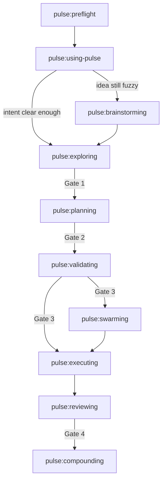

# Pulse Architecture

This document explains the shape of Pulse: what lives where, how the workflow moves, and which runtime pieces support it.

If you are new to the project, start with [README.md](../README.md). If you need the exact behavioral contract for a specific phase, read the corresponding `skills/*/SKILL.md`.

## In One Sentence

Pulse is a repo-local workflow system where skill docs define behavior, Node helpers keep the workflow operable, and human approval gates prevent agents from skipping important decisions.

## The Mental Model

Think of Pulse as four cooperating layers:

1. **Skill contract**: `skills/*/SKILL.md` defines how each phase behaves.
2. **Control plane**: `.pulse/` holds live state, onboarding status, handoffs, and scout surfaces.
3. **Feature record**: `history/<feature>/` holds the durable story of one feature.
4. **Shared memory**: `.pulse/memory/` stores cross-feature learnings and ratchets.

That separation is intentional:

- skill docs define the rules
- runtime helpers keep those rules usable
- feature artifacts capture one delivery slice
- memory artifacts improve future slices

## The Delivery Chain



### What each phase is responsible for

| Phase | Responsibility |
| --- | --- |
| `preflight` | Check tooling, onboarding, and usable mode |
| `using-pulse` | Scout, route, and decide the first correct skill |
| `brainstorming` | Turn vague intent into a shaped design |
| `exploring` | Lock decisions into `CONTEXT.md` |
| `planning` | Route mode → shape, then define current work artifacts and bead timing |
| `validating` | Prove feasibility/readiness of the selected current work before execution |
| `swarming` | Coordinate parallel workers |
| `executing` | Implement one bead at a time |
| `reviewing` | Run review, findings, and UAT gates |
| `compounding` | Promote durable learnings into shared memory |

### The 4 human gates

| Gate | Happens after | Why it exists |
| --- | --- | --- |
| Gate 1 | Exploring | No planning before decisions are locked |
| Gate 2 | Planning | No execution prep before the selected shape artifact is approved |
| Gate 3 | Validating | No execution before feasibility-validated current work is approved |
| Gate 4 | Reviewing | No merge while P1 findings still exist |

## System Boundaries

Pulse is:

- a workflow plugin
- docs-first
- repo-local
- compatible with single-worker and swarm execution

Pulse is not:

- an always-on control tower
- a replacement for human approval
- a reason to skip validating
- a pure chat-only process with no durable artifacts

## Planes And Artifacts

### 1. Control plane: `.pulse/`

This is the live runtime surface.

Key files:

| Path | Purpose |
| --- | --- |
| `.pulse/tooling-status.json` | Preflight output and recommended mode |
| `.pulse/state.json` | Machine-readable routing mirror |
| `.pulse/STATE.md` | Human-readable current state |
| `.pulse/handoffs/manifest.json` | Pause/resume index |
| `.pulse/project-docs.json` | Mapping for repo-owned project docs |

Use `node .pulse/scripts/pulse_status.mjs --json` as the first scout read when the repo is onboarded.

### 2. Feature record plane: `history/<feature>/`

This is the durable record for one feature or slice.

Typical contents vary by selected shape:

```text
history/<feature>/
  CONTEXT.md
  discovery.md
  approach.md
  work-shape.md
  phase-plan.md
  epic-map.md
  current-story-pack.md
  phase-<n>-contract.md
  phase-<n>-story-map.md
  verification/
  lifecycle-summary.md
```

Important rule: `CONTEXT.md` is the source of truth for locked decisions.

### 3. Shared memory plane: `.pulse/memory/`

This is where Pulse keeps reusable learnings across features.

```text
.pulse/memory/
  critical-patterns.md
  learnings/
  corrections/
  ratchet/
  dream-pending/
```

Use it for durable lessons, not for noisy session chatter.

### 4. Work graph plane: `.beads/` and `.spikes/`

- `.beads/` holds the planned work graph
- `.spikes/` holds validation experiments for risky items

Beads are the unit of execution. Chat threads are not.

## Runtime Roles

### Router and scout

`pulse:using-pulse` is the session router. It does not replace deeper skills. It decides which skill should take over next and keeps startup/resume behavior sane.

### Planner and validator

`pulse:planning` and `pulse:validating` define whether execution should happen at all. Planning routes mode → shape and current work; validating confirms feasibility/readiness before execution starts.

### Coordinator

`pulse:swarming` owns orchestration only:

- it assigns work
- it watches progress
- it resolves or escalates conflicts
- it does not directly implement beads

### Worker

`pulse:executing` owns implementation:

- claim bead
- read bead scope and decision refs
- reserve files if swarming
- implement
- verify
- record evidence
- close bead

### Reviewer and compounder

`pulse:reviewing` decides whether the feature is safe to merge. `pulse:compounding` decides what future work should remember.

## Working Modes

Pulse uses one architecture but several operating shapes:

| Mode | Best for | Still true |
| --- | --- | --- |
| `small_change` | Local, bounded, low-risk work | Decisions and validating still matter |
| `standard_feature` | Normal feature delivery | Full chain is the default |
| `high_risk_feature` | Cross-cutting or architecture-sensitive work | Same chain, stricter scrutiny |
| `planning-only` | Environments not ready for execution | Planning can continue, execution cannot |
| `blocked` | Onboarding or readiness is broken | Return to preflight/remediation |

`Micro Mode` is a narrow exception handled by `pulse:using-pulse`. It is not a normal architecture mode.

## Session Startup And Resume

The preferred startup path is:

1. `pulse:preflight`
2. `pulse:using-pulse`
3. `node .pulse/scripts/pulse_status.mjs --json`
4. Open only the artifacts the scout points at

When resuming:

1. Check `.pulse/handoffs/manifest.json`
2. Re-open the selected owner handoff if one exists
3. Re-check `.pulse/state.json` and `.pulse/STATE.md`
4. Continue only when the handoff and current state do not conflict

Authority order for resume decisions:

1. active handoff manifest
2. selected owner handoff file
3. current state mirrors

## Coordination Model

Pulse coordinates execution with a small set of durable tools:

| Tool | Role |
| --- | --- |
| `br` | Create, update, close, and sync beads |
| `bv --robot-*` | Inspect and triage the bead graph |
| `.pulse/scripts/pulse_reservations.mjs` | Prevent overlapping edits in swarm mode |
| Native runtime subagents | Provide the actual workers |
| `gitnexus` | Optional discovery acceleration |

Important coordination rules:

- reserve files before editing in swarm mode
- release reservations before declaring completion or pause
- do not treat a chat thread as the work graph
- use `bv --robot-*`, never interactive `bv`, in automated sessions

## Project Docs Versus Feature Docs

Pulse keeps repo-level project docs separate from feature history.

Repo-level project docs may include:

- root `CONTEXT.md`
- `CONTEXT-MAP.md`
- `docs/adr/`

Feature docs live under `history/<feature>/`.

Why the separation matters:

- project docs define stable repo truth
- feature history explains one delivery slice
- Pulse should reuse repo language before inventing new terms

## Context Budget And Handoffs

Long-running work should pause cleanly rather than degrade.

Pulse rule of thumb:

- if session context grows past about 65%, write a handoff
- register it in `.pulse/handoffs/manifest.json`
- make the next actor resume from there

This is how Pulse preserves continuity without pretending the model has infinite working memory.

## Skill Map

The high-level grouping matters more than a full per-skill manual here.

### Core chain

| Group | Skills |
| --- | --- |
| Setup | `preflight`, `using-pulse` |
| Design and decision lock | `brainstorming`, `exploring` |
| Planning and readiness | `planning`, `validating` |
| Execution | `swarming`, `executing` |
| Finish | `reviewing`, `compounding` |

### Support skills

| Skill | Use when |
| --- | --- |
| `gitnexus` | You need graph-backed discovery |
| `systematic-debug-fix` | Execution is blocked by bugs or failing behavior |
| `architecture-rescue` | The repo shape needs a report-first rescue view |
| `bootstrap-project-context` | Repo docs need onboarding or mapping |
| `refresh-project-docs` | Public docs drift from repo reality |
| `dev-note`, `dev-note-distil`, `dream` | You are curating learnings rather than executing features |
| `prompt-leverage` | A weak prompt needs better structure |
| `writing-pulse-skills` | You are changing Pulse itself |

For exact prompts, checklists, and hard rules, read the relevant `skills/*/SKILL.md`.

## What Architecture Intentionally Leaves Out

This document does not try to replace the skills.

It intentionally avoids:

- full per-skill checklists
- repeated operator cookbook details from the README
- deep implementation notes already encoded in `SKILL.md`
- line-by-line onboarding or evaluation instructions

Use this document to understand the shape of the system. Use the skill docs to run the system.
