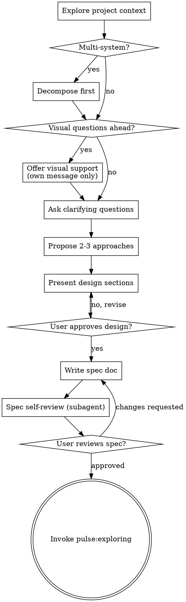

# Brainstorming Skill

Turns vague intent into a documented, approved design spec through structured dialogue —
before any codebase research or implementation planning begins.

Research shows that validated designs reduce planning rework by stopping assumption drift before it compounds.

<HARD-GATE>
Do NOT invoke any implementation skill, write any code, create beads, or take any
implementation action until a design has been presented AND the user has approved it.
This applies regardless of perceived simplicity. The design can be short — but it MUST
exist and be approved.
</HARD-GATE>

## Anti-Pattern: "This is too simple to need a design"

Every feature goes through this process. A config flag, a single function, a UI tweak —
all of them. "Simple" projects are where unexamined assumptions cause the most wasted
planning work. The spec can be a paragraph. But you MUST present it and get approval.

---

## Quick Reference

| Step | What you do | What you produce |
|---|---|---|
| Explore context | Read just enough project material to understand what already exists | Internal context snapshot |
| Assess scope | Decide whether this is one feature or multiple independent systems | Scoped brainstorming target |
| Visual decision point | Decide whether upcoming questions are easier to answer by seeing options | User consent for visual support, or text-only path |
| Clarifying questions | Ask one question at a time to uncover purpose, constraints, and success criteria | Validated requirements |
| Approaches | Present 2–3 viable directions with trade-offs | Chosen direction |
| Design | Present the solution in sections and validate incrementally | Approved design |
| Spec | Write the approved design to `history/<feature>/spec.md` | Stable spec for exploring |
| Self-review | Run the spec reviewer subagent and fix serious issues | Planning-ready spec |
| User review gate | Wait for explicit approval on the written spec | Approved handoff artifact |
| Handoff | Update `.pulse/STATE.md` and direct the next step to `pulse:exploring` | Clean pipeline transition |

---

## Checklist

Create a task for each item and complete them in order:

1. **Explore project context** — read files, docs, recent commits relevant to the request
2. **Assess scope** — is this one feature or multiple independent systems? (see Decomposition)
3. **Offer visual support** — if upcoming questions would be easier to answer by seeing options, offer visuals in their own message
4. **Ask clarifying questions** — one at a time; purpose, constraints, success criteria
5. **Propose 2–3 approaches** — with trade-offs and your recommendation
6. **Present design** — in sections scaled to complexity; get user approval after each section
7. **Write spec doc** — save to `history/<feature>/spec.md` and note the path
8. **Spec self-review** — subagent check for placeholders, contradictions, scope, ambiguity
9. **User reviews spec** — ask user to confirm before proceeding
10. **Handoff to exploring** — invoke `pulse:exploring` to lock implementation decisions

---

## Process Flow



**The terminal state is invoking `pulse:exploring`.** Do NOT invoke planning, validating,
or any execution skill. After brainstorming, the ONLY valid next step is `pulse:exploring`.

---

## Phase 1: Explore Context

Before asking any question, understand what already exists:

- Check relevant files, docs, and the last few commits related to the topic
- Identify existing patterns, components, or decisions that constrain the design
- Note what can be reused vs. what needs to be created from scratch

Build an internal picture first — it makes your clarifying questions concrete instead of generic.

---

## Phase 2: Scope Assessment

Before asking detailed questions, assess whether the request is one feature or several:

**One feature** — scoped work with a clear boundary. Continue normally.

**Multiple independent systems** — e.g., "build a platform with auth, billing, and analytics."
Flag this immediately:

> "This covers [A], [B], and [C] — three independent systems. Each needs its own
> brainstorming session. Let's start with [most foundational]. I'll note the others for later."

Then brainstorm the first sub-system through the full flow. Each sub-system gets its own
spec → exploring → planning → execution cycle.

---

## Visual Decision Point

When upcoming questions involve layout, visual hierarchy, diagrams, flows, or side-by-side
interface choices, offer visual support once before continuing.

Use this offer as its own message:

> "Some of this may be easier to evaluate if I show concrete options instead of only describing them in text. I can use inline previews or small mockups for the visual decision points. Want me to do that when it helps?"

<HARD-GATE>
This offer MUST be its own message. Do NOT combine it with a clarifying question,
a context summary, or a recommendation. Ask, wait, then continue.
</HARD-GATE>

**How to decide:**

- **Use visuals** for layout comparisons, information hierarchy, diagrams, wireframes, and other questions where seeing options will reduce ambiguity.
- **Stay in text** for goals, scope, constraints, prioritization, trade-offs, and conceptual choices.
- A UI topic is not automatically visual. "Which outcome matters most?" is text. "Which dashboard layout is closer?" is visual.

**How to present visual choices:**

- Prefer `AskUserQuestion` with `preview` for side-by-side concrete artifacts.
- Escalate to the local visual server only for genuinely complex visual ambiguity: styling direction, multi-screen flow shape, design-system composition, dense layout comparison, or hierarchy questions where a browser-rendered screen will clarify faster than previews.
- Start it with `scripts/start-visual-server.sh --project-dir <repo-root>`.
- If startup fails or Node is unavailable, continue with previews and text. Do NOT block the session on the runtime.
- Keep choices focused — 2–4 options max.
- Use single-select for competing directions; use multi-select only for independent add-on ideas.
- If a preview, mockup, or browser screen will not make the decision clearer, do not create one.

Accepting visual support does NOT turn the whole session visual. Decide per question whether text or visuals are the better fit.

---

## Phase 3: Clarifying Questions

<HARD-GATE>
Ask ONE question at a time. Wait for the user's response before the next.
Do NOT batch questions. Do NOT answer your own questions.
This gate is non-negotiable — sequential questioning surfaces significantly more
latent requirements than batched approaches.
</HARD-GATE>

**Rules:**

- One question per message — never bundled
- Multiple-choice preferred over open-ended when possible
- Start broad (what, why, for whom) then narrow (constraints, edge cases, success criteria)
- 3–4 questions per topic area, then checkpoint: "More questions about [area], or move on?"

**Question patterns:**

- **Product intent / constraints** → text multiple-choice or short open-ended question
- **Competing layouts / hierarchy / flows** → offer visual support first, then use previews, mockups, or the advanced runtime when needed
- **Trade-off choice** → keep it in text unless the trade-off is inherently visual
- **Checkpointing** → after a few questions on one area, confirm whether to continue or advance

Examples:
- Text: "Which primary outcome should this optimize for first?"
- Visual: "Which of these three dashboard layouts is closer to the experience you want?"

**Scope creep** — when the user suggests something out of scope:
> "[Feature X] is a new capability — that's its own work item. I'll note it as a
> deferred idea. Back to [current topic]: [return to question]"

---

## Phase 4: Propose Approaches

Present 2–3 different approaches before committing to one:

- Describe each option concisely with its trade-offs
- Lead with your recommended option and explain why
- Invite the user to push back or ask about specific trade-offs

Do NOT start designing until the user picks a direction.

---

## Phase 5: Present Design

Once the direction is clear, present the design:

- Scale each section to its complexity — a few sentences if simple, 200–300 words if nuanced
- Ask "Does this look right so far?" after each section before moving to the next
- Cover: architecture, key components, data flow, error handling, testing strategy
- Be ready to revise — if something doesn't make sense, go back and clarify

**Design for isolation:**

- Break the system into units each with one clear purpose and well-defined interfaces
- For each unit: what does it do, how do you use it, what does it depend on?
- Can someone understand a unit without reading its internals? Can you change the internals
  without breaking consumers? If not, the boundaries need work.

**Working in existing codebases:**

- Follow existing patterns — don't propose unrelated refactoring
- Where existing code has problems that affect the work (a file that's grown too large,
  tangled responsibilities), include targeted improvements as part of the design
- Stay focused on what serves the current goal

---

## Phase 6: Write Spec Doc

After the user approves the design, write the spec:

**Path:** `history/<feature-slug>/spec.md`

The spec must include:
- Problem statement and goals
- Approved approach (one sentence summary)
- Architecture and key components
- Data flow
- Error handling approach
- Testing strategy
- Out of scope (explicitly list what was deferred)

---

## Phase 7: Spec Self-Review

After writing the spec, spawn a subagent to review it:

```
You are a spec document reviewer. Verify this spec is complete and ready for planning.

Spec to review: history/<feature>/spec.md

What to check:
| Category     | What to Look For |
|--------------|-----------------|
| Completeness | TODOs, placeholders, "TBD", incomplete sections |
| Consistency  | Internal contradictions, conflicting requirements |
| Clarity      | Requirements ambiguous enough to cause building the wrong thing |
| Scope        | Focused enough for a single feature cycle |
| YAGNI        | Unrequested features, over-engineering |

Calibration: Only flag issues that would cause real problems during planning.
Approve unless there are serious gaps.

Output:
Status: Approved | Issues Found
Issues (if any): [Section] — [specific issue] — [why it matters for planning]
Recommendations (advisory, do not block): [suggestions]
```

- If Issues Found: fix inline, re-spawn reviewer, repeat (max 2 iterations)
- After 2 iterations with unresolved issues: ask the user to review directly

---

## Phase 8: User Review Gate

After the spec self-review passes:

> "Spec written to `history/<feature>/spec.md`. Please review it and let me know if
> you want any changes before we start locking implementation decisions."

Wait for the user's response. If they request changes: make them, re-run the self-review
loop. Only proceed once the user approves.

---

## Phase 9: Handoff

After user spec approval:

1. Update `.pulse/STATE.md`:
   ```
   Current: brainstorming complete for <feature>
   Spec: history/<feature>/spec.md
   Next: invoke pulse:exploring to lock implementation decisions
   ```

2. Present to user:
   > "Spec approved. Invoke `pulse:exploring` to extract implementation decisions
   > (gray areas, scope boundaries, and locked choices) before planning begins."

<HARD-GATE>
Do NOT invoke planning, create beads, or write any code.
The terminal state of this skill is a written, approved spec and STATE update.
The ONLY valid next step is the user invoking pulse:exploring.
</HARD-GATE>

---

## Key Principles

- **One question at a time** — never overwhelm
- **Multiple-choice preferred** — easier to answer than open-ended
- **Use visuals only when they clarify** — seeing options should remove ambiguity, not add noise
- **YAGNI ruthlessly** — remove unrequested features from all designs
- **Always propose alternatives** — 2–3 approaches before settling
- **Incremental validation** — present design in sections, get approval before continuing
- **Be ready to revise** — go back and clarify when something doesn't fit

---

## What This Skill Does NOT Do

These are `pulse:exploring`'s responsibilities — not yours:

- Deep codebase research (only quick context reads here)
- Locking implementation decisions with stable IDs (D1, D2...)
- Gray area extraction against domain probes
- Writing `CONTEXT.md` (exploring does this)
- Creating beads or work items

Brainstorming delivers a design spec. Exploring delivers locked decisions.
Planning consumes both.

---

## Red Flags

Stop immediately if you catch yourself doing any of these:

- Writing code or pseudocode during the design phase
- Asking two questions in the same message
- Offering visual support and a clarifying question in the same message
- Skipping the spec because the feature "seems obvious"
- Answering a question you just asked
- Treating every UI topic as visual instead of deciding per question
- Invoking planning or executing before spec is approved
- Creating beads or referencing bead IDs

---

## Anti-Patterns

**"The user wants to move fast"**
Speed comes from clarity. A 10-minute design session prevents hours of planning rework
caused by wrong assumptions baked into beads.

**"I already know what to build"**
Your assumptions are hypotheses until the user validates them.
Run Phase 3 and let the user confirm the direction.

**"This is too small to document"**
The spec can be three sentences. But it MUST exist so exploring has a stable target.

**"This is a visual topic, so every question should be a mockup"**
No. Use visuals only when seeing options will remove ambiguity. Goals, priorities, and constraints still belong in plain text.

---

## References

- `references/spec-reviewer-prompt.md` — subagent prompt for spec document review
- `references/visual-support-guidance.md` — when to use previews vs the advanced visual runtime during brainstorming
