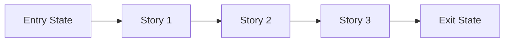

# Phase Contract: Phase <N> - <Phase Name>

**Date**: <YYYY-MM-DD>
**Feature**: <feature-slug>
**Phase Plan Reference**: `history/<feature>/phase-plan.md`
**Based on**:
- `history/<feature>/CONTEXT.md`
- `history/<feature>/discovery.md`
- `history/<feature>/approach.md`

---

## 1. What This Phase Changes

> Explain the phase in practical terms first. Someone should be able to picture what is different after this lands.

`<2-4 sentences describing the real-world/system change this phase delivers.>`

---

## 2. Why This Phase Exists Now

- `<why this phase is first or why it follows the previous one>`
- `<what would be blocked or riskier if this phase were skipped>`

---

## 3. Entry State

> What is true before this phase starts?

- `<observable truth 1>`
- `<observable truth 2>`
- `<constraint or dependency already satisfied>`

---

## 4. Exit State

> What must be true when this phase is complete?

- `<observable truth 1>`
- `<observable truth 2>`
- `<integration or system-level truth>`

**Rule:** every exit-state line must be testable or demonstrable.

---

## 5. Unlocks Next

> Name what later phases/stories become safe, possible, or cheaper after this phase lands.

- `<specific downstream phase/story this unlocks>`
- `<specific risk removed for downstream work>`
- `<specific capability now available to build on>`

---

## 6. Locked Assumptions vs Open Ambiguities

### Locked Assumptions (must hold; if broken, stop and re-plan)

- `<assumption tied to system behavior or contract>`
- `<assumption tied to dependency or interface stability>`

### Open Ambiguities (known unknowns; can proceed with bounded risk)

- `<unknown that does not block phase start>`
- `<unknown with explicit validation path during phase>`

### Ambiguity Exit Rule

- If a locked assumption is false, **pause execution** and update plan/contract.
- If an open ambiguity becomes phase-blocking, convert it into a locked item and re-approve.

---

## 7. Demo Walkthrough

> The simplest walkthrough that proves this phase is real.

`<In one short paragraph: "A user can now..." or "The system can now...">`

### Demo Checklist

- [ ] `<step 1>`
- [ ] `<step 2>`
- [ ] `<step 3>`

---

## 8. Story Sequence At A Glance

> Stories explain why the internal order of this phase makes sense before beads are created.

| Story | What Happens | Why Now | Unlocks Next | Done Looks Like |
|-------|--------------|---------|--------------|-----------------|
| Story 1: `<name>` | `<practical outcome>` | `<why first>` | `<what it unlocks>` | `<observable done>` |
| Story 2: `<name>` | `<practical outcome>` | `<why next>` | `<what it unlocks>` | `<observable done>` |
| Story 3: `<name>` | `<practical outcome>` | `<why last>` | `<what it unlocks>` | `<observable done>` |

---

## 9. Phase Diagram

If the phase has fewer than 3 stories, remove the unused nodes and keep the diagram aligned to the actual sequence.

---

## 10. Out Of Scope

- `<thing intentionally not solved in this phase>`
- `<adjacent idea deferred to a later phase>`

---

## 11. Success Contract (Execution + Validation)

> This is the gate definition for moving forward.

### Execution Success

- [ ] Every planned story reaches its "Done Looks Like" condition.
- [ ] No unresolved blocker remains hidden as "follow-up" work.
- [ ] Story-to-bead mapping is explicit enough for swarming handoff.

### Validation Success

- [ ] Exit-state statements are directly demonstrated by tests, checks, or walkthrough evidence.
- [ ] Evidence location is recorded (`history/<feature>/verification/...`).
- [ ] Any assumption changes are reflected back into this contract.

### Gate Decision Rule

- Advance only when **both** execution and validation success are true.
- If either side fails, phase stays open and plan/contract is revised.

---

## 12. Failure / Pivot Signals

> If any of these happen, do not blindly continue to later phases.

- `<signal that means the phase design is wrong>`
- `<signal that means the current approach should pivot>`
- `<signal that means the next phase should be reconsidered>`
