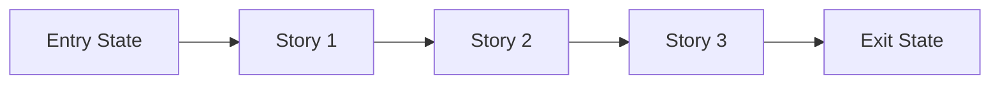
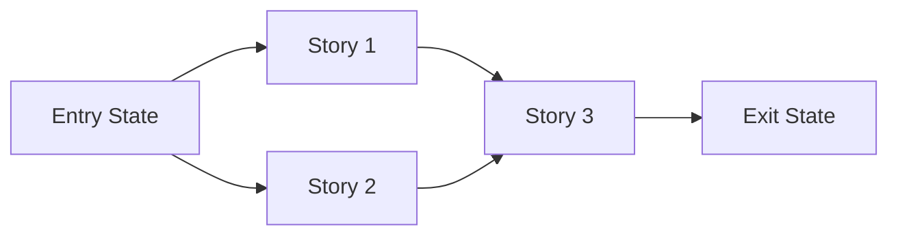

# Story Map: Phase <N> - <Phase Name>

**Date**: <YYYY-MM-DD>
**Phase Plan**: `history/<feature>/phase-plan.md`
**Phase Contract**: `history/<feature>/phase-<n>-contract.md`
**Approach Reference**: `history/<feature>/approach.md`

---

## 1. Story Dependency Diagram

Replace the placeholder story nodes with the actual story names.

If stories are parallel, make that explicit and show the rejoin point:

---

## 2. Story Execution Structure

| Story | Mode (Serial/Parallel) | Depends On | Blocks | Shared File/Context Risk | Why This Mode Is Safe |
|-------|-------------------------|------------|--------|--------------------------|-----------------------|
| Story 1: `<name>` | `<Serial or Parallel>` | `<entry state or prior story>` | `<next story or none>` | `<none or files/contracts likely to collide>` | `<why this can run in chosen mode>` |
| Story 2: `<name>` | `<Serial or Parallel>` | `<prior story or entry state>` | `<next story or none>` | `<none or files/contracts likely to collide>` | `<why this can run in chosen mode>` |
| Story 3: `<name>` | `<Serial or Parallel>` | `<prior stories>` | `<exit state or next phase>` | `<none or files/contracts likely to collide>` | `<why this can run in chosen mode>` |

Use this table to justify parallelism, not just claim it.

---

## 3. Story Table

| Story | What Happens In This Story | Why Now | Contributes To | Creates | Unlocks | Done Looks Like |
|-------|-----------------------------|---------|----------------|---------|---------|-----------------|
| Story 1: `<name>` | `<practical outcome>` | `<why first>` | `<phase exit-state item>` | `<artifact or capability>` | `<next story>` | `<observable proof>` |
| Story 2: `<name>` | `<practical outcome>` | `<why next>` | `<phase exit-state item>` | `<artifact or capability>` | `<next story>` | `<observable proof>` |
| Story 3: `<name>` | `<practical outcome>` | `<why last>` | `<phase exit-state item>` | `<artifact or capability>` | `<what comes after phase>` | `<observable proof>` |

---

## 4. Story Details

### Story 1: <Name>

- **What Happens In This Story**: `<what becomes true after this story>`
- **Why Now**: `<why it belongs before the next story>`
- **Execution Mode**: `<Serial or Parallel (with which story)>`
- **Contributes To**: `<which exit-state statement this story advances>`
- **Creates**: `<code, contract, data, capability>`
- **Unlocks**: `<what later stories can now do>`
- **Shared File / Shared Context Risk**: `<none, low, medium, high + where>`
- **Done Looks Like**: `<observable finish line>`
- **Candidate Bead Themes**:
  - `<bead theme 1>`
  - `<bead theme 2>`
- **Testing Discipline Hint**: `<smoke, focused integration, full integration/regression>`

### Story 2: <Name>

- **What Happens In This Story**: `<what becomes true after this story>`
- **Why Now**: `<why it belongs here>`
- **Execution Mode**: `<Serial or Parallel (with which story)>`
- **Contributes To**: `<which exit-state statement this story advances>`
- **Creates**: `<code, contract, data, capability>`
- **Unlocks**: `<what later stories can now do>`
- **Shared File / Shared Context Risk**: `<none, low, medium, high + where>`
- **Done Looks Like**: `<observable finish line>`
- **Candidate Bead Themes**:
  - `<bead theme 1>`
  - `<bead theme 2>`
- **Testing Discipline Hint**: `<smoke, focused integration, full integration/regression>`

### Story 3: <Name>

- **What Happens In This Story**: `<what becomes true after this story>`
- **Why Now**: `<why it closes the phase>`
- **Execution Mode**: `<Serial or Parallel (with which story)>`
- **Contributes To**: `<which exit-state statement this story advances>`
- **Creates**: `<code, contract, data, capability>`
- **Unlocks**: `<next phase or larger plan>`
- **Shared File / Shared Context Risk**: `<none, low, medium, high + where>`
- **Done Looks Like**: `<observable finish line>`
- **Candidate Bead Themes**:
  - `<bead theme 1>`
  - `<bead theme 2>`
- **Testing Discipline Hint**: `<smoke, focused integration, full integration/regression>`

Remove any unused story sections and keep only the stories the phase actually needs.

---

## 5. Story Order + Parallelism Check

> If a human reads only this file, they should not need to ask why the order and concurrency choices are safe.

- [ ] Story 1 is obviously first (or explicitly parallel-safe from entry state)
- [ ] Every serial dependency is explicit and justified
- [ ] Every claimed parallel path names collision risks and coordination plan
- [ ] If every story reaches "Done Looks Like", the phase exit state should be true

If any box is unchecked, revise the map before creating beads.

---

## 6. Story-To-Bead Mapping

> Fill this in after bead creation so validating and swarming can see how the narrative maps to executable work.

| Story | Beads | Shared Risk Notes | Test Discipline Needed |
|-------|-------|-------------------|------------------------|
| Story 1: `<name>` | `<br-id>, <br-id>` | `<shared file/context dependency note>` | `<smoke, focused integration, full integration/regression>` |
| Story 2: `<name>` | `<br-id>, <br-id>` | `<shared file/context dependency note>` | `<smoke, focused integration, full integration/regression>` |
| Story 3: `<name>` | `<br-id>, <br-id>` | `<shared file/context dependency note>` | `<smoke, focused integration, full integration/regression>` |

Use this to decide where stricter testing is mandatory before swarm execution starts.
