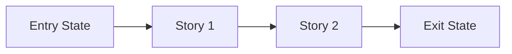

# Pulse Planning Runtime Reference

Use this appendix as the primary template source for planning artifacts. Keep outputs concise, outcome-first, and consistent with locked decisions in `history/<feature>/CONTEXT.md`.

---

## 1) Discovery Template (`history/<feature>/discovery.md`)

```markdown
# Discovery Report: <Feature Name>

**Date**: <YYYY-MM-DD>
**Feature**: <feature-slug>
**Discovery output**: `history/<feature>/discovery.md`
**CONTEXT.md reference**: `history/<feature>/CONTEXT.md`

## Institutional Learnings

### Critical Patterns
- <applied pattern or "None applicable">

### Domain-Specific Learnings
| File | Module | Key Insight | Severity |
|------|--------|-------------|----------|
| <path> | <module> | <gotcha/pattern> | high/medium |

## Architecture Snapshot
| Area | Purpose | Key Paths |
|------|---------|-----------|
| <module> | <responsibility> | <paths> |

## Pattern Search
| Implementation | Location | Pattern Used | Reusable? |
|----------------|----------|--------------|-----------|
| <similar work> | <path> | <pattern> | Yes/Partial/No |

## Constraints
- Runtime/toolchain: <details>
- Build/quality commands: <commands>
- Dependency constraints: <details>

## External / Adjacent Research (if needed)
| Source | Version/Date | Key Reference |
|--------|--------------|---------------|
| <source> | <date> | <url/path/summary> |

## Open Questions
- [ ] <question>

## Summary for Synthesis
**What we have**: <1-2 sentences>
**What we need**: <1-2 sentences>
**Key constraints**: <bullets>
**Institutional warnings**: <bullets>
```

---

## 2) Approach Template (`history/<feature>/approach.md`)

```markdown
# Approach: <Feature Name>

**Date**: <YYYY-MM-DD>
**Feature**: <feature-slug>
**Based on**:
- `history/<feature>/discovery.md`
- `history/<feature>/CONTEXT.md`

## 1. Gap Analysis
| Component | Have | Need | Gap Size |
|---|---|---|---|
| <component> | <existing> | <needed> | small/medium/large |

## 2. Recommended Approach
<3-5 sentences>

### Why This Approach
- <reason tied to existing pattern>
- <reason tied to locked decision>
- <reason tied to discovery>

### Architecture Baseline for Phase Slicing
#### Enduring Foundations
- <foundation>
- <invariant>

#### Ownership and Contracts
| Boundary | Owner | Contract / Interface | Constraint to Preserve |
|---|---|---|---|
| <boundary> | <owner> | <shape> | <constraint> |

## 3. Alternatives Considered
- Option A: <name> — <why rejected>
- Option B: <name> — <why rejected>

## 4. Risk Map
| Component | Risk Level | Reason | Validation Owner | Spike Question | Affected Beads |
|---|---|---|---|---|---|
| <component> | LOW/MEDIUM/HIGH | <reason> | validating or n/a | <YES/NO or n/a> | <beads> |

For each HIGH row include:
- 2-3 concrete options
- recommended option
- user-visible decision to lock
- whether affected beads require `testing_mode: tdd-required`

## 5. Proposed File Structure
```text
<expected directories and files>
```

## 6. Dependency Order
- Group A: <work>
- Group B: <depends on A>

## 7. Institutional Learnings Applied
| Learning Source | Key Insight | How Applied |
|---|---|---|
| <file> | <insight> | <application> |

## 8. Open Questions for Validating
- [ ] <question>
```

---

## 3) Phase Plan Template (`history/<feature>/phase-plan.md`)

```markdown
# Phase Plan: <Feature Name>

**Date**: <YYYY-MM-DD>
**Feature**: <feature-slug>
**Based on**:
- `history/<feature>/CONTEXT.md`
- `history/<feature>/discovery.md`
- `history/<feature>/approach.md`

## 1. Feature Summary
<2-4 sentences in plain language>

## 2. Whole-Feature Architecture Baseline
### Enduring Foundations
- <foundation>

### Ownership Boundaries
| Area / Module | Owner | Responsibilities In Scope | Explicitly Out Of Scope |
|---|---|---|---|
| <module> | <owner> | <scope> | <non-goals> |

### Interfaces and Contracts
| Interface / Contract | Producer | Consumer | Contract Shape | Stability Expectation |
|---|---|---|---|---|
| <contract> | <owner> | <owner> | <shape> | <expectation> |

## 3. Why This Breakdown
- <why phase 1 first>
- <why later phases stay separate>
- <risk/ambiguity contained by phasing>

## 4. Phase Overview
| Phase | What Changes In Real Life | Why This Phase Exists Now | Demo Walkthrough | Unlocks Next |
|-------|----------------------------|---------------------------|------------------|--------------|
| Phase 1: <name> | <outcome> | <why first> | <proof> | <next> |
| Phase 2: <name> | <outcome> | <why second> | <proof> | <next> |

## 5. Phase Details
For each phase include:
- What Changes In Real Life
- Why This Phase Exists Now
- Architecture Decisions Applied
- Boundary Integrity Check
- Stories Inside This Phase
- Demo Walkthrough
- Unlocks Next

## 6. Phase Order Check
- [ ] Phase 1 is obviously first
- [ ] Dependencies are explicit
- [ ] No phase is a technical bucket only

## 7. Approval Summary
- Approval status: `PENDING | APPROVED | REVISE_REQUIRED`
- Approved phase to prepare next: `Phase <n> - <name> | none`
- Approved at: `<ISO-8601 | pending>`
- Current phase to prepare next: `Phase <n> - <name>`

## 8. Epic Snapshot Inputs
- Total phases: `<N>`
- Current phase: `Phase <n> - <name>`
- Completed phases: `<list or none>`
- Final phase ready: `yes | no`

Use these values to refresh the whole-feature epic bead snapshot after planning each phase. The epic snapshot is convenience metadata only; `phase-plan.md` and `.pulse/STATE.md` remain the source of truth.
```

---

## 4) Current Phase Contract Template (`history/<feature>/phase-<n>-contract.md`)

```markdown
# Phase Contract: Phase <N> - <Phase Name>

**Date**: <YYYY-MM-DD>
**Feature**: <feature-slug>
**Phase Plan Reference**: `history/<feature>/phase-plan.md`

## 1. What This Phase Changes
<2-4 practical sentences>

## 2. Why This Phase Exists Now
- <why now>
- <what is blocked/riskier if skipped>

## 3. Entry State
- <truth before phase>

## 4. Exit State
- <observable truth after phase>
- <observable truth after phase>

## 5. Unlocks Next
- <specific downstream unlock>

## 6. Locked Assumptions vs Open Ambiguities
### Locked Assumptions
- <must hold>
### Open Ambiguities
- <bounded unknown>

## 7. Demo Walkthrough
<one paragraph>

## 8. Story Sequence At A Glance
| Story | What Happens | Why Now | Unlocks Next | Done Looks Like |
|-------|--------------|---------|--------------|-----------------|
| Story 1: <name> | <outcome> | <why first> | <unlock> | <proof> |

## 9. Out Of Scope
- <not in this phase>

## 10. Success Contract
### Execution Success
- [ ] stories reach done criteria
- [ ] blockers are explicit

### Validation Success
- [ ] exit-state claims are proven
- [ ] evidence path recorded

### Gate Decision Rule
- advance only when execution + validation both pass

## 11. Failure / Pivot Signals
- <signal>
```

---

## 5) Current Phase Story Map Template (`history/<feature>/phase-<n>-story-map.md`)

```markdown
# Story Map: Phase <N> - <Phase Name>

**Date**: <YYYY-MM-DD>
**Phase Plan**: `history/<feature>/phase-plan.md`
**Phase Contract**: `history/<feature>/phase-<n>-contract.md`

## 1. Story Dependency Diagram


## 2. Story Execution Structure
| Story | Mode | Depends On | Blocks | Shared Risk | Why Safe |
|------|------|------------|--------|-------------|----------|
| Story 1: <name> | Serial/Parallel | <deps> | <blocks> | <risk> | <why> |

## 3. Story Table
| Story | What Happens | Why Now | Contributes To | Creates | Unlocks | Done Looks Like |
|------|---------------|---------|----------------|---------|---------|-----------------|
| Story 1: <name> | <outcome> | <why> | <exit-state item> | <artifact> | <next> | <proof> |

## 4. Story Details
For each story include:
- What Happens In This Story
- Why Now
- Execution Mode (+ parallel safety)
- Contributes To
- Creates
- Unlocks
- Shared File/Context Risk
- Done Looks Like
- Candidate Bead Themes
- Testing Discipline Hint

## 5. Story Order + Parallelism Check
- [ ] Story order is causally justified
- [ ] Parallel claims include collision controls
- [ ] Story completion implies phase exit state

## 6. Story-To-Bead Mapping (post bead creation)
| Story | Beads | Shared Risk Notes | Test Discipline Needed |
|------|-------|-------------------|------------------------|
| Story 1: <name> | <br-id> | <risk note> | <discipline> |
```

---

## Planning Invariants Checklist

Before handoff, confirm:
- Foundation-first architecture baseline exists before phase slicing.
- Gate 2 approval is explicit and synced (`phase-plan.md` + `.pulse/STATE.md`).
- Project-docs-first behavior was followed.
- Planning is phase-oriented (whole-feature -> current approved phase only).
- Stop/handoff conditions are explicit (`pulse:validating` next, no direct swarming handoff).
